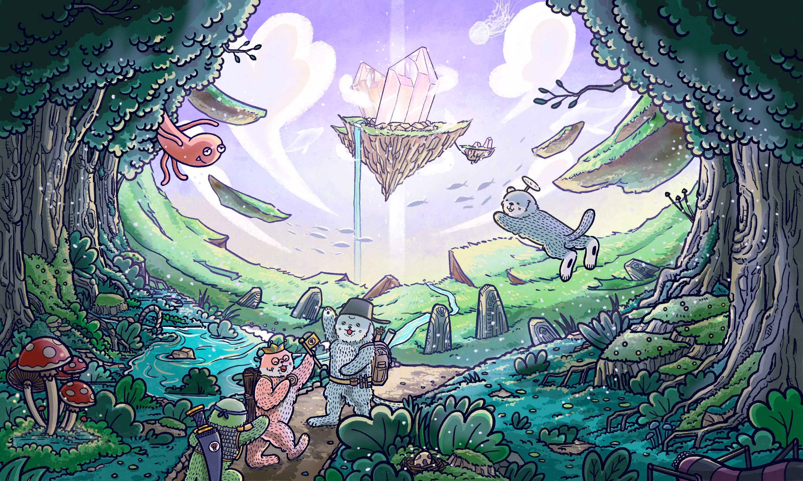

# Introduction

Assemble your rafts, Otters!!!

Otto is the first official citizen of the Otter Kingdom. Each Otto is an **ERC721 NFT** with unique traits and attributes. These NFTs are not only irresistibly cute, but they also happen to be the main characters of OtterClam’s first adventure game – Ottopia.

By combining both **DeFi** and **NFT** elements, we have created a unique, group-adventure game that gives your Genesis Collection Otto NFTs even more utility. By owning an Otto NFT from the Genesis Collection, you’re eligible to play Ottopia. Your Otto, Cleo, or Lottie will also act as your personal governance token, which allows you to vote on any Otto-related proposals submitted in the Otter DAO. 

Before we dive into the mechanics of the game and how you can use your new NFTs, we’d like to share with you the story of the original discovery of the Otter Kingdom on Ottopia, a floating island-kingdom in the Otterverse.

## Origin Story

Most Otters living in the Otter Kingdom today don’t remember their lives as humans. Those who do remember, wish they didn’t. The end of the world was just as harrowing and tragic as most predicted. Sea levels rose, and many nations were swallowed up entirely by the rising tides. Once temperate climates became uninhabitable. Food became scarce, and as sea levels rose, clean water became almost impossible to find. 

Survivors searched desperately for a place to live. They searched for a hero. Soon, objective descriptions of real events gave way to extravagant stories of valor. Though most of the names and faces within each tale changed to captivate the storyteller’s audience, there were two details that never altered.
The first detail would seem irrelevant were it not so consistent. The odd fellow’s name at the heart of every story was always “Otto.” The second detail? This Otto character always disappears suddenly into a hazy shadow of swirling particles.

Legend has it that Otto was a cryptographer-physicist who had created a simple device capable of deciphering an array of previously unknown, extraterrestrial signals. As the story goes, this same device could then arrange these particles affected by the signal into wormholes - a portal of sorts - large enough for a human to enter. Where did they lead? No one really knows. The stories about what lies on the other side of the portal are as strange as they are numerous.

Those who knew Otto and reportedly saw this spectacle, have since died. They described him as obsessed, quirky, and strangely optimistic – an eccentric fellow to say the least. Their stories had the strange effect of leaving listeners feeling both despondent and hopeful. They desperately needed the Otto legend to be true, but could it be that he really found a way to escape his inevitable demise? Did he really find a portal to a better place? A utopia?

Well, not exactly…

Otto’s portal discovery transported him to a bizarre planet where anyone who passed through the wormhole created by his device became Otters. Although the planet there was as wild and undisturbed as the deepest parts of the Amazon rainforest back on earth, it had everything Otto needed to be able to survive. 

Clams as well as other small, river-dwelling species suitable for an otter’s nourishment were abundant. Occasionally on his journey, he would see the shell of a clam shimmer, as if it were coated in gold or silver. He once saw a single clam shell dusted in diamonds that would’ve been worth millions back home.

 As confused as Otto was about his new surroundings, he was even more confused by the unusual signal he was receiving from the device he brought from the other side. It was leading him somewhere, but…where???

After following the signal through the vibrant, colorful jungle, along a river full of sparkling clams, Otto arrives at a scene stranger than anything he had seen or even read about back on earth. The signal he had been following, which seemed to follow the path of the river perfectly, suddenly became much stronger. 

Soon, Otto saw the trees begin to clear and as the sky opened up, he saw something that defied all comprehension. The water somehow began to separate from the riverbed, upwards towards the sky. Once the clearing widened even more, he saw the river leading to what could only be described as…a floating island. 

He had no idea what else was on the island, but it was clearly the source of the beautiful river he had been following through the jungle, providing him clean water and more clams than he could ever eat. Otto realized the only way to access the floating island was by swimming against the current, upstream to the island’s entrance.

Before embarking, Otto realizes in a moment of clarity, that in case something happens to him, he must first try to let others know about this paradise in the sky and this bizarre, beautiful land he had found. Once he returns to the portal deep in the heart of the jungle, he picks up a single cracked clam from the river’s edge, and on the inside, sketches a map that leads to the floating island along with a brief message: “Follow Clam River.” 

Too scared to go back through the portal himself, he immediately tosses the shell, together with the device, directly into the portal. Back on earth, in one of the few remaining forests, the shell lands on the ground beside the portal-generating device, undiscovered for years – until now. 

This marks the beginning of your mission to find Ottopia - the paradise island in the sky.

## How it Works
Below this section, you can find more details on each aspect of the game. Please keep in mind that some of the details are subject to change. We are presenting the following information to help familiarize our community with the way the Otto NFT ecosystem will operate. 

To begin, everyone starts the game gathered around the device, staring at the partially-opened clam with a map etched into the shell, containing Otto’s mysterious message. Once you’re ready to take the leap into the Otterverse, you must initiate the portal. By minting an Otto, you are generating enough power to create a single portal. By entering the Otterverse through the portal, you are transformed into Otto, Cleo, or Lottie. 

In the Otterverse, you will have a new name, a new body, and even a new lifestyle. Of course, you will also have different strengths and weaknesses in the form of attributes and traits - more on that later. The goal is to successfully complete a mission. 

To do this, Otters must work together to form teams of Ottos, Cleos, and Lotties who have the right mix of attributes and traits to allow them to successfully complete the mission. Over time, the signal coming from Ottopia can be deciphered, providing you and your team with the information necessary to complete the mission. 

Since each NFT from the Otto Genesis Collection will have unique traits and attributes, it will be up to each player to find other players to create a team of Ottos with the best attribute-trait profiles to successfully complete the mission. Once teams have been created, they will receive IDs that correspond to wallet addresses. A leaderboard will be available on the app to monitor your team’s progress, and the progress of others. 

Winners will not just earn bragging rights, they’ll also receive the largest portion of the CLAM-reward pool set aside for Ottopia missions, as well as a chance to receive super-rare, air-dropped equipment.

Finally, for all of you non-gamer Otters, there’s other ways to have fun while earning CLAM. Otto Market, a stand-alone NFT Market (not on production yet, but it's in the roadmap!) will have portals, equipment, and potions on offer. Want the chance to create an Otto, Cleo, or Lottie with extremely rare traits using the portal without having to play the game? The Otto Market might just be for you. This mini-market will also serve as a trial run for the much larger PAW Market coming out later this year. 

Now that we’ve shared the Origin Story and given you an overview of the game, let’s dive into some of the finer details.
