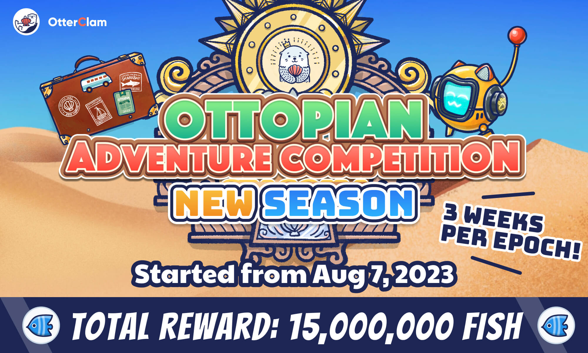
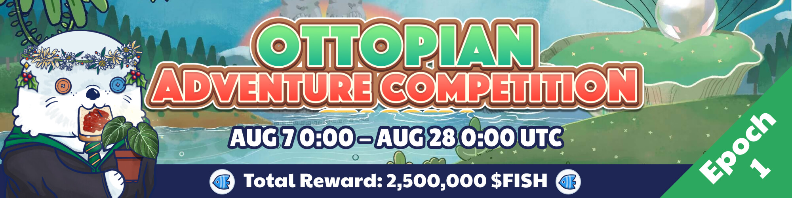
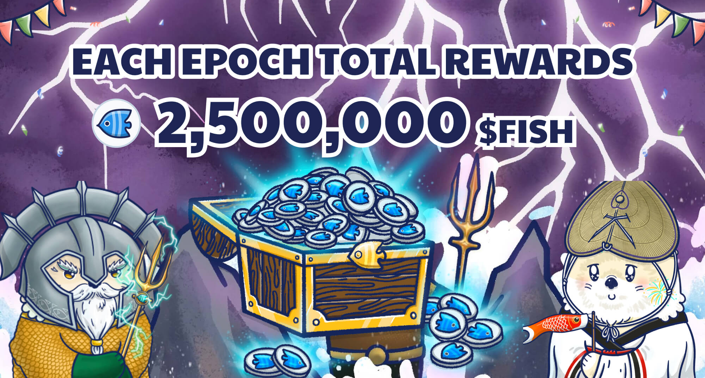

# Adventure Leaderboard - New Season

<header>
<meta property="og:title" content="Ottopia Whitepaper | Adventure Leaderboard - New season" />
<meta property="og:image" content="https://imgur.com/v4pnw4J.jpg" />
<meta property="og:description" content="Gather ‘round the stream, Otters! The new season of the Adventure Leaderboard is here, pack your bags and get ready to become the king of the adventure!" />
</header>

## Introduction

Welcome to the Adventure Leaderboard, a hub of excitement in the farming system! We're ecstatic to introduce the latest season of this exhilarating game.

The rules are straightforward: the more quests your Otto undertakes, the higher its ascent on the leaderboard. Climb the ranks, and reap increasingly lavish rewards. But caution is key - each adventure holds its unique perils and trials, so strategize your path with care.

Do you fancy venturing into the enigmatic Lohaje Desert, filled with mystery and danger? Or challenging the perilous Frozen Mountain, exploring the joyful Golden Beach, or pioneering into unexplored territories? The Adventure Leaderboard presents limitless avenues for exploration and bounty.

Grab your reliable gear, sharpen your abilities, and enlist in the new season of Adventure Leaderboard. The time has come to prove your mettle to the Ottopia community and seize your rightful position at the pinnacle of the leaderboard!

---

## 1st Epoch 

* Event Duration: Aug 7, 2023 0:00 ~ Aug 28, 2023 0:00 (UTC)

Click [here](https://ottopia.app/leaderboard?adventure=1&epoch=23) to view the current AP ranking of all Ottos for this epoch.

---

## How to play

Send your Ottos to the adventure and get the **Adventure Points (AP)**. 
Your accumulated AP for each round determines your ranking on the leaderboard.
Collect your fish rewards!

## What are the Adventure Points? How can I get them?

Unlike in Raking for Rarity where the metric for climbing the leaderboard is the total Rarity Score, the Adventure Leaderboard uses **Adventure Points** as the metric. The amount of AP you have earned during each epoch determines your ranking on the leaderboard. 

As long as your Otto successfully completes an Adventure, your Otto would receive Adventure Points from the area. The amount of Adventure Points you get correspond to the difficulty as shown in the chart below. 

| Area Difficulty | Adventure Points (AP) |
| --------------- | --------------------- |
| 💀              | 10                    |
| 💀 (Golden Beach) | 8                    |
| 💀💀            | 20                    |
| 💀💀💀          | 40                    |
| 💀💀💀💀        | 60                    |
| 💀💀💀💀💀      | 80                    |

Take note that Adventure Points will be erased and reset at the end of each epoch of the Adventure Competition. Everyone starts each epoch on equal footing. This way, the most adventurous Otto NFTs during the epoch will be rewarded the most.

## Reward

The reward of the Adventure Competition is in $FISH. We are preparing a total of 15 million $FISH for this season! Each epoch’s reward will be 2.5 million $FISH.

Start going on adventures with your Otto gang and earn these juicy $FISH!

To learn more about Adventure Points and how the advenuture system works, please go to [Adventure](../gameplay/adventure#adventure-points-).