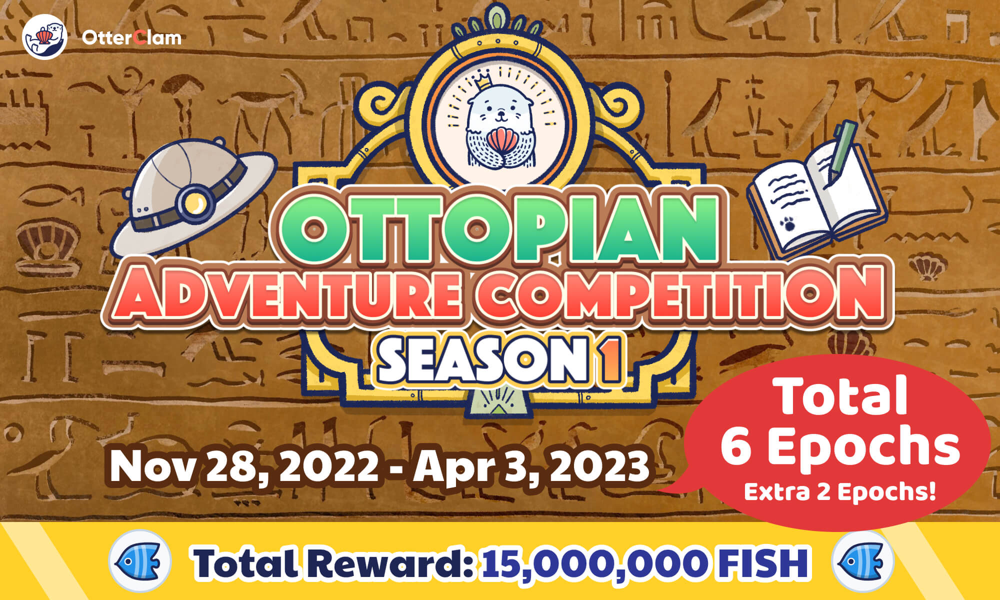
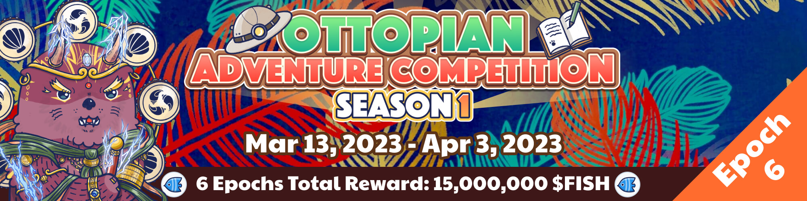
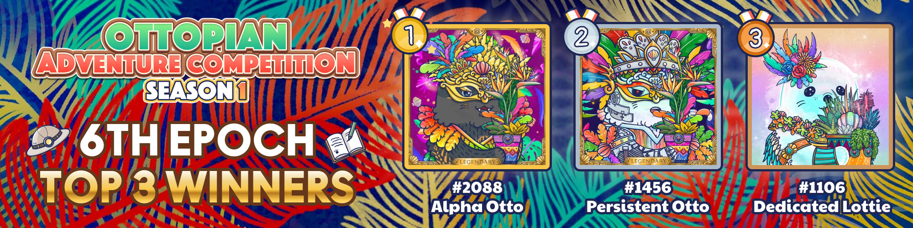
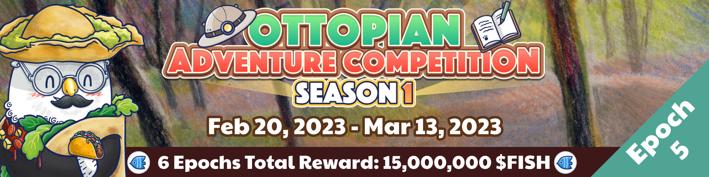
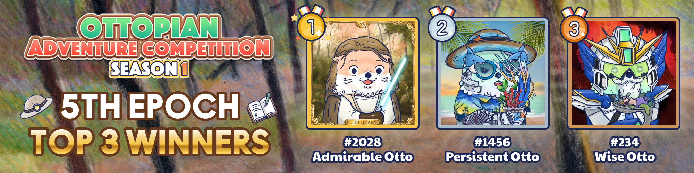
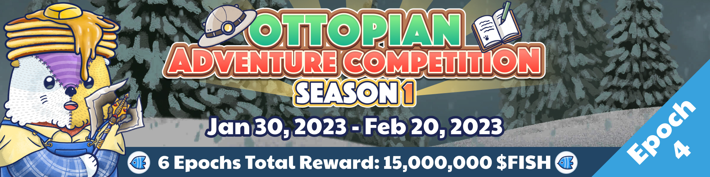
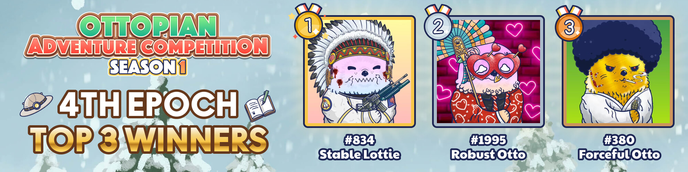
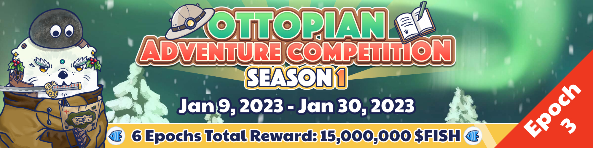
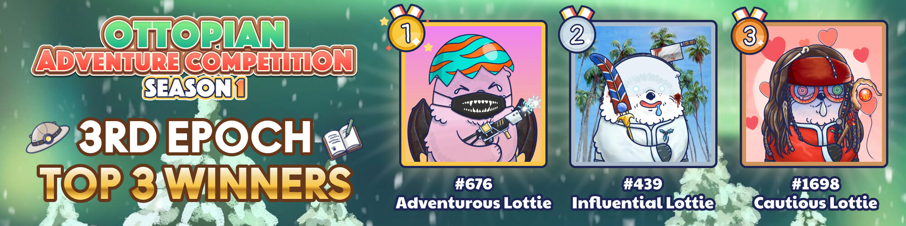
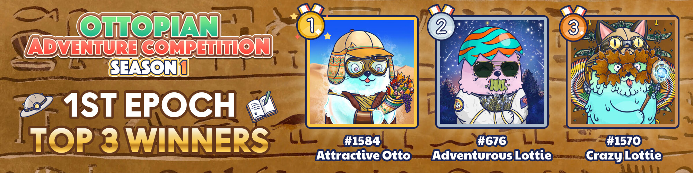

# Adventure Leaderboard - Season 1

<header>
<meta property="og:title" content="Ottopia Whitepaper | Adventure Leaderboard - Season 1" />
<meta property="og:image" content="https://docs.ottopia.app/assets/images/1st-al-ogimage-7cff5b06bacecc1bd368a93cf650dd00.jpg" />
<meta property="og:description" content="Gather ‘round the stream, Otters! Season 1 of the Adventure Leaderboard is here, pack your bags and get ready to become the king of the adventure!" />
</header>

## Introduction

Another farming game is coming! After Raking for Rarity, Ottopia has once again launched a new farming system — Adventure Leaderboard! 

The more adventures your Otto completes, the higher its ranking will be on the leaderboard. The higher your Otto's rank is, the more rewards you'll receive – so assess your risk tolerance and embark on your adventure!

---

## 6th Epoch (Ended) 

* Event Duration: Mar 13, 2023 0:00 ~ Apr 3, 2023 0:00 (UTC)

The epoch has ended and the top 3 winners are as follows:

Click [here](https://ottopia.app/leaderboard?adventure=1&epoch=16) to view the final AP ranking of all Ottos for this epoch.

---

## 5th Epoch (Ended) 

* Event Duration: Feb 20, 2023 0:00 ~ Mar 13, 2023 0:00 (UTC)

The epoch has ended and the top 3 winners are as follows:

Click [here](https://ottopia.app/leaderboard?adventure=1&epoch=15) to view the final AP ranking of all Ottos for this epoch.

---

## 4th Epoch (Ended) 

* Event Duration: Jan 30, 2023 0:00 ~ Feb 20, 2023 0:00 (UTC)

The epoch has ended and the top 3 winners are as follows:

Click [here](https://ottopia.app/leaderboard?adventure=1&epoch=14) to view the final AP ranking of all Ottos for this epoch.

---

## 3rd Epoch (Ended) 

* Event Duration: Jan 9, 2023 0:00 ~ Jan 30, 2023 0:00 (UTC)

The epoch has ended and the top 3 winners are as follows:

Click [here](https://ottopia.app/leaderboard?adventure=1&epoch=13) to view the final AP ranking of all Ottos for this epoch.

---

## 2nd Epoch (Ended) 

* Event Duration: Dec 19, 2022 0:00 ~ Jan 9, 2023 0:00 (UTC)

The epoch has ended and the top 3 winners are as follows:

Click [here](https://ottopia.app/leaderboard?adventure=1&epoch=12) to view the final AP ranking of all Ottos for this epoch.

---

## 1st Epoch (Ended) 

* Event Duration: Nov 28, 2022 0:00 ~ Dec 19, 2022 0:00 (UTC)

The epoch has ended and the top 3 winners are as follows:

Click [here](https://ottopia.app/leaderboard?adventure=1&epoch=11) to view the final AP ranking of all Ottos for this epoch.

---

## How to play

Send your Ottos to the adventure and get the **Adventure Points (AP)**. 
Your accumulated AP for each round determines your ranking on the leaderboard.
Collect your fish rewards!

## What are the Adventure Points? How can I get them?

Unlike in Raking for Rarity where the metric for climbing the leaderboard is the total Rarity Score, the Adventure Leaderboard uses **Adventure Points** as the metric. The amount of AP you have earned during each epoch determines your ranking on the leaderboard. 

As long as your Otto successfully completes an Adventure, your Otto would receive Adventure Points from the area. The amount of Adventure Points you get correspond to the difficulty as shown in the chart below. 

| Area Difficulty | Adventure Points (AP) |
| --------------- | --------------------- |
| 💀              | 10                    |
| 💀💀            | 20                    |
| 💀💀💀          | 40                    |
| 💀💀💀💀        | 60                    |
| 💀💀💀💀💀      | 80                    |

Take note that Adventure Points will be erased and reset at the end of each epoch of the Adventure Competition. Everyone starts each epoch on equal footing. This way, the most adventurous Ottos during the epoch will be rewarded the most.

## Reward

The reward of the Adventure Competition is in $FISH. We are preparing a total of 15 million $FISH for this season! Each epoch’s reward will be 2.5 million $FISH.

Start going on adventures with your Otto gang and earn these juicy $FISH!

To learn more about Adventure Points and how the advenuture system works, please go to [Adventure](../gameplay/adventure#adventure-points-).