# Adventure Leaderboard - Season 2

<header>
<meta property="og:title" content="Ottopia Whitepaper | Adventure Leaderboard - Season 2" />
<meta property="og:image" content="https://docs.ottopia.app/assets/images/2nd-al-ogimage-476870bd8d48862cd1fba8e7e00e92de.jpg" />
<meta property="og:description" content="Gather ‘round the stream, Otters! Season 2 of the Adventure Leaderboard is here, pack your bags and get ready to become the king of the adventure!" />
</header>

## Introduction

Welcome to one of the most exciting farming system - Adventure Leaderboard! After the success of the 1st season, we're thrilled to bring you the 2nd season of this thrilling new game.

The premise is simple: the more adventures your Otto completes, the higher it climbs on the leaderboard. And the higher its rank, the greater the rewards you'll receive. But beware - every adventure comes with its own risks and challenges, so choose your path wisely.

Whether you prefer to explore mysterious and dangerous Lohaje Desert, brave treacherous Frozen Mountain, or chart new territory in uncharted lands, Adventure Leaderboard offers endless possibilities for adventure and reward.

So dust off your trusty gear, hone your skills, and join us for the 2nd season of Adventure Leaderboard. It's time to show the Ottopia community what you're made of and claim your place at the top of the leaderboard!

---

## 6th Epoch 

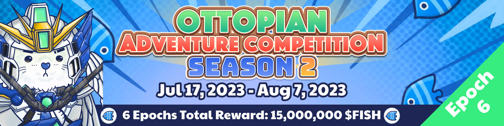

* Event Duration: Jul 17, 2023 0:00 ~ Aug 7, 2023 0:00 (UTC)

The epoch has ended and the top 3 winners are as follows:

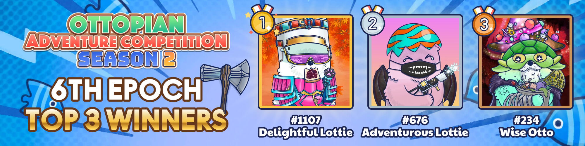

Click [here](https://ottopia.app/leaderboard?adventure=1&epoch=22) to view the final AP ranking of all Ottos for this epoch.

---

## 5th Epoch 

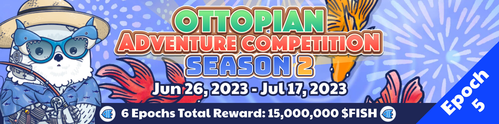

* Event Duration: Jun 26, 2023 0:00 ~ Jul 17, 2023 0:00 (UTC)

The epoch has ended and the top 3 winners are as follows:

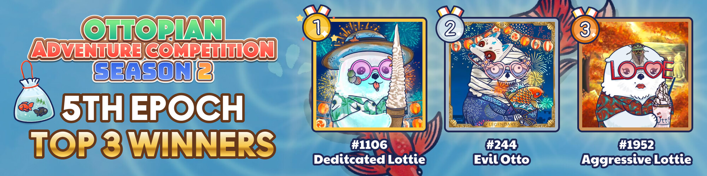

Click [here](https://ottopia.app/leaderboard?adventure=1&epoch=21) to view the final AP ranking of all Ottos for this epoch.

---

## 4th Epoch 

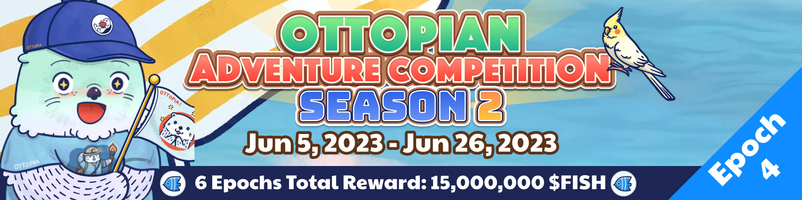

* Event Duration: Jun 5, 2023 0:00 ~ Jun 26, 2023 0:00 (UTC)

The epoch has ended and the top 3 winners are as follows:

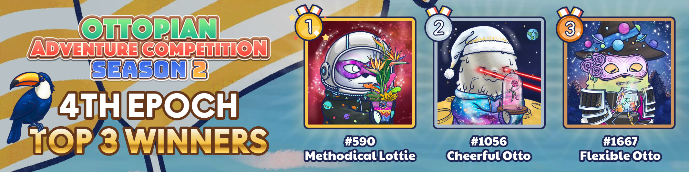

Click [here](https://ottopia.app/leaderboard?adventure=1&epoch=20) to view the final AP ranking of all Ottos for this epoch.

---

## 3rd Epoch (Ended) 

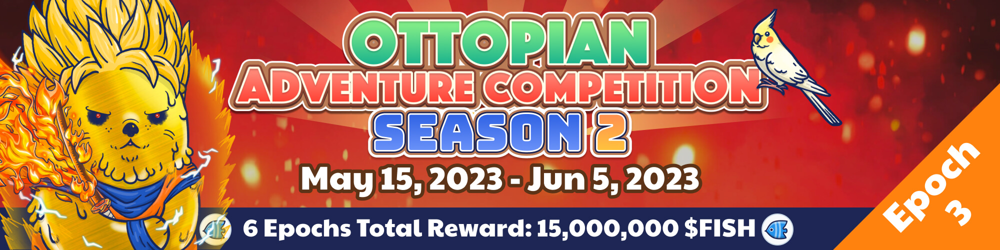

* Event Duration: May 15, 2023 0:00 ~ Jun 5, 2023 0:00 (UTC)

The epoch has ended and the top 3 winners are as follows:

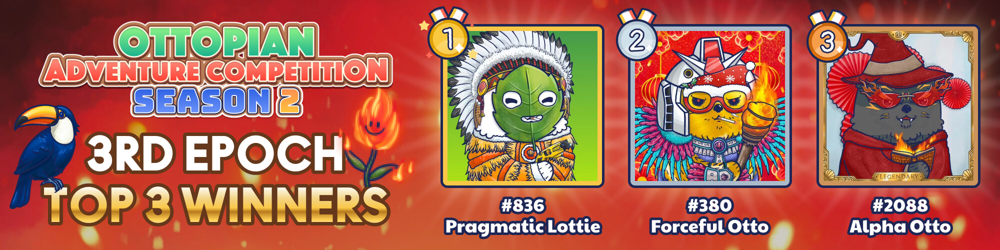

Click [here](https://ottopia.app/leaderboard?adventure=1&epoch=19) to view the final AP ranking of all Ottos for this epoch.

---

## 2nd Epoch (Ended) 

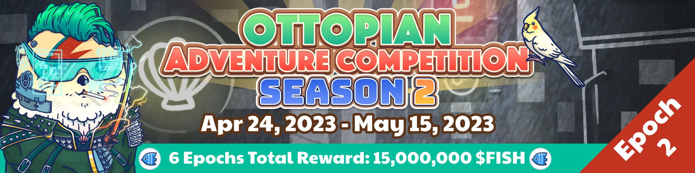

* Event Duration: Apr 24, 2023 0:00 ~ May 15, 2023 0:00 (UTC)

The epoch has ended and the top 3 winners are as follows:

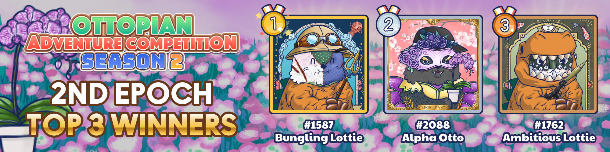

Click [here](https://ottopia.app/leaderboard?adventure=1&epoch=18) to view the final AP ranking of all Ottos for this epoch.

---

## 1st Epoch 

* Event Duration: Apr 3, 2023 0:00 ~ Apr 24, 2023 0:00 (UTC)

The epoch has ended and the top 3 winners are as follows:

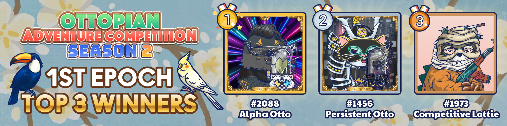

Click [here](https://ottopia.app/leaderboard?adventure=1&epoch=17) to view the final AP ranking of all Ottos for this epoch.

---

## How to play

Send your Ottos to the adventure and get the **Adventure Points (AP)**. 
Your accumulated AP for each round determines your ranking on the leaderboard.
Collect your fish rewards!

## What are the Adventure Points? How can I get them?

Unlike in Raking for Rarity where the metric for climbing the leaderboard is the total Rarity Score, the Adventure Leaderboard uses **Adventure Points** as the metric. The amount of AP you have earned during each epoch determines your ranking on the leaderboard. 

As long as your Otto successfully completes an Adventure, your Otto would receive Adventure Points from the area. The amount of Adventure Points you get correspond to the difficulty as shown in the chart below. 

| Area Difficulty | Adventure Points (AP) |
| --------------- | --------------------- |
| 💀              | 10                    |
| 💀💀            | 20                    |
| 💀💀💀          | 40                    |
| 💀💀💀💀        | 60                    |
| 💀💀💀💀💀      | 80                    |

Take note that Adventure Points will be erased and reset at the end of each epoch of the Adventure Competition. Everyone starts each epoch on equal footing. This way, the most adventurous Otto NFTs during the epoch will be rewarded the most.

## Reward

The reward of the Adventure Competition is in $FISH. We are preparing a total of 15 million $FISH for this season! Each epoch’s reward will be 2.5 million $FISH.

Start going on adventures with your Otto gang and earn these juicy $FISH!

To learn more about Adventure Points and how the advenuture system works, please go to [Adventure](../gameplay/adventure#adventure-points-).