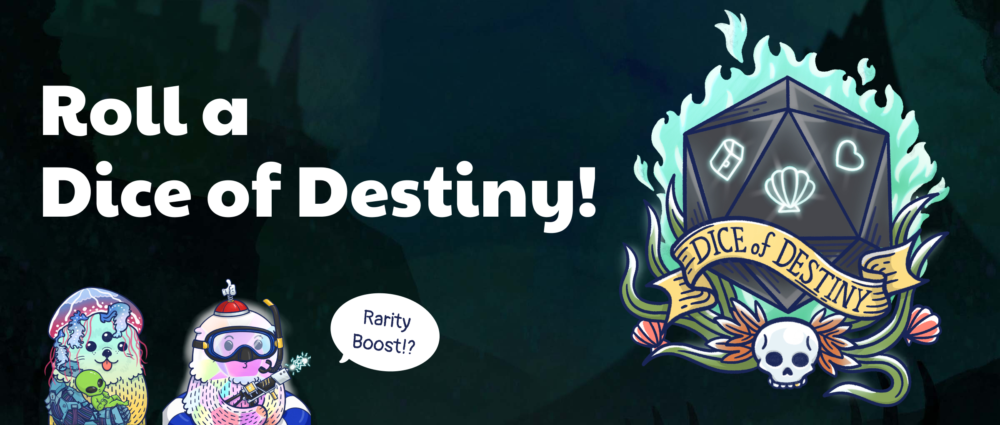

# Rarity Competition - New Season

<header>
<meta property="og:title" content="Ottopia Whitepaper | Rarity Competition - New Season" />
<meta property="og:image" content="https://imgur.com/7tuWegX.jpg" />
<meta property="og:description" content="Gather ‘round the stream, Otters! The new season of the Rarity Competition is here, and will add another layer of depth to the contest - theme systems and a new bonus mechanism." />
</header>

## Introduction

Attention Otters!

Get ready for the thrilling fourth season of the Rarity Competition, launching on August 7th, 2023! This new season promises a blend of challenges and excitement, with each epoch unfolding over a three-week span.

The goal of the competition? To amass as many Rarity Scores as you can! Engage in various activities to climb the leaderboard - open themed chests in the [Ottopia Store](../gameplay/store.md), roll [Dice of Destiny](#dod), or craft new treasures in the [Ottopia Foundry](../gameplay/foundry.md).

But there's more! The Ottopia Discord server will be buzzing with events that offer special boost items to elevate your rarity score. Make sure to join in, seize the advantages, and leap ahead in the competition.

So, gather your $MATIC tokens and brace yourselves to stake, trade, and battle in this season's Rarity Competition! The most distinguished Otters by the end of every epoch will be awarded an enormous stash of $WMATIC prizes.

Here's your opportunity to shine, to flaunt your skills, and to demonstrate your mastery of Rarity. Don't let this chance slip away - the challenge awaits!

Shortcuts to each Rarity Competition epoch:

* [1st Epoch - Back to school](#1st-epoch)

---

## 1st Epoch - Back to School 

* Event Duration: Aug 7, 2023 0:00 ~ Aug 28, 2023 0:00 (UTC)

Greetings, adventurers! Are you ready to head "Back to School" in a world filled with enchantment and wonder? Join us as we open the doors to a magical **School** where the hallways echo with mystic spells and the **Green** gardens flourish with extraordinary **Plants** like the captivating Mandrake.

Whether you're a fan of the wizarding world of Harry Potter or enamored by Japanese animation, our school-themed celebration has something for everyone. Uncover secrets, learn magical arts, and embrace the spirit of the "School" where imagination knows no bounds.

So put on your robes or school uniforms, and let the magic of learning begin! Welcome to the "Back to School" party – where education becomes an adventure!

### Rewards

The reward pool for this epoch is **TBD $WMATIC**. Rarity Competition rewards will be shared with only the top 50% of Ottos, so don't miss out!

Click [here](https://ottopia.app/leaderboard?epoch=23) to view the current rarity ranking of all Otto NFTs for this epoch.

---

## How to Play 

Each 3-week epoch will have a different theme, and each theme will have two to three specific item labels that will entitle an item with one or more themed labels to a rarity boost. Item labels can be found when viewing the item in the “My Items” section of the Ottopia app. As long as the player wears an item with a theme-specific label, the player will receive a rarity boost to their Otto.

Here is how the theme rarity boosts are calculated:

- If the item has one theme-specific label, **+60 boost**
- If the item has two theme-specific labels,**+120 boost**
- If the item has three theme-specific labels, **+180 boost**

After adding the scores above, there will be a "set bonus" multiplier added if the Otto is wearing multiple items with a theme-specific label:

- One item with theme-specific labels = **x1 multiplier boost**
- Two items with theme-specific labels = **x1.5 multiplier boost**
- Three items with theme-specific labels = **x1.7 multiplier boost**
- Four items with theme-specific labels = **x2 multiplier boost**
- Five items with theme-specific labels = **x2.5 multiplier boost**

For example, in the image below we see if an Otto is wearing five items, two of which match one label and one item that matches two labels at the same time, the BRS bonus would be calculated as (60+60+120)*1.7 = 408 

In the image below, notice that the rarity of the item itself is still calculated. The final rarity score = Original rarity score (RRS+BRS) + 408 (Extra BRS)

With the new theme system, competitors have even more ways to climb to the top of the rarity leaderboard, and claim those juicy CLAM prizes. You won’t want to miss out!

### Calculating rarity

There are 2 types of rarity scores in play here - Base Rarity Score (for traits and wearable items) & Absolute Rarity Score. In the [Rarity Score page](../gameplay/rarity-farming.md), there is more detailed information that you should learn if you'd like to dig deeper in rarity farming.

## Extra rarity score bonus

Despite the factors listed above, your Otto's birthday and identity may also affect your rarity score!

### Legendary bonus

Every legendary Otto will be blessed with **100 BRS** bonus permanently, but if any Otto's genetic item has been replaced by any other item, the bonus will be removed until the items are set back to the defult.

### Constellation bonus

If the reward settlement date falls on your Otto's constellation, your Otto will receive a **50 BRS** bonus in this epoch! The constellation bonus will reset after each epoch ends.

For example: If the next reward settlement date is May 21, the date falls to Taurus. Every Otto, Lottie and Cleo whose star sign is Taurus will +50 BRS until the next epoch.

### The Chosen Otto bonus

If the reward settlement date falls exactly on your Otto's birthday, it means your Otto is the chosen one! Your Otto will receive a **150 BRS** bonus in this epoch! The constellation bonus will reset after each epoch ends.

For example: If the next reward settlement date is May 21, every Otto, Lottie and Cleo whose birthday is May 21 will +150 BRS until the next epoch. 

> *Note: The birthday bonus cannot combine with the constellation bonus.*

The chart below shows the defined constellation's start/end date, and the bonus rules.

## Other rarity score boost method

Despite of the genetic factors, here the Otter Kingdom also provides a powerful but a bit risky method for the player to boost your Otto's rarity tempararily to improve ranking in the leaderboard:

### Dice of Destiny 

The Dice of Destiny gives players a chance to temporarily boost your BRS for the current epoch in the Raking for Rarity Competition, but there’s a possibility that your Otto will lose some BRS as well.

* Each roll produces a single, randomized result out of dozens of possible results.
* Some of the results have a positive effect on your Otto’s BRS, While some have a negative effect on your Otto’s BRS.
* Some results require an additional selection. Your choice will determine the fate of your Otto.
* The BRS effect from rolling the Dice of Destiny only lasts for the current epoch, and will be removed as soon as it ends.
* The Dice results only affect the Otto you choose to roll a dice for.

The following list shows the percentage of the result types you will get in every single event:

- Good result:	**42.5%**
- Bad result:	**34.5%**
- Options*:	**23.0%**

*Depending on how you answer the question, you might get good or bad results. 

If you haven’t already minted an Otto from our Genesis Collection, you can do so at the [Ottopia App](http://ottopia.app). For more information about the competition and the Ottopia protocol in general, please swim down to our [Discord](https://discord.gg/jdCk93R2) and say hello!

Until then, OGMI
