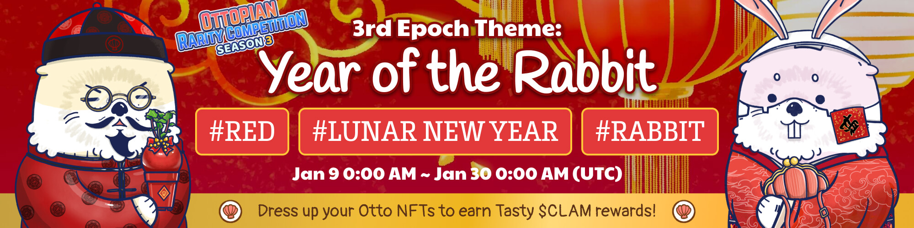
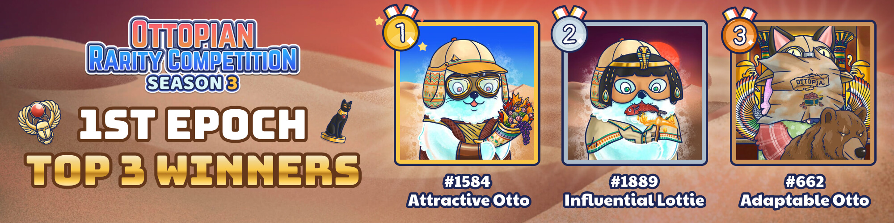
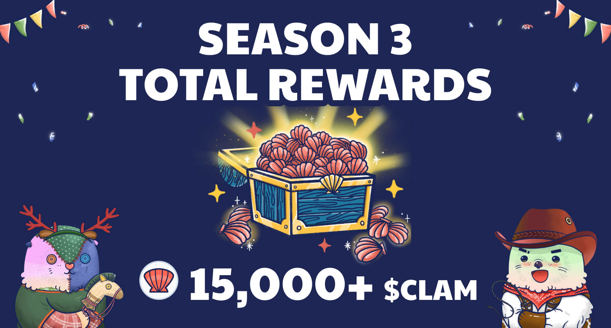

# Rarity Competition - Season 3

<header>
<meta property="og:title" content="Ottopia Whitepaper | Rarity Competition - Season 3" />
<meta property="og:image" content="https://docs.ottopia.app/assets/images/3rd-ror-ogimage-42f502d6aa430f9efaa22e3e62e8a2a5.jpg" />
<meta property="og:description" content="Gather ‘round the stream, Otters! Season 3 of the Rarity Competition is here, and will add another layer of depth to the contest - theme systems and a new bonus mechanism." />
</header>

## Introduction

Gather ‘round the stream, Otters!

Season 2 of the Raking for Rarity competition is in the books - another milestone that kicked off the Ottopian games!

Top spots changed hands at the 11th hour. CLAM prizes were distributed to hundreds of Ottos vying for the grand prize. The top ranked Ottos received prizes worth hundreds of dollars at current CLAM prices. It was quite a fight! 

If you missed out, don’t worry. Season 3 of the Rarity Competition is here, and will add another layer of depth to the contest - theme systems and a new bonus mechanism.

Shortcuts to each Rarity Competition epoch:

* 4th Epoch (Coming soon)
* [3rd Epoch - Year of the Rabbit](#3rd-epoch)
* [2nd Epoch - White Ottermas](#2nd-epoch)
* [1st Epoch - Pharaoh's Secret](#1st-epoch)

## 3rd Epoch - Year of the Rabbit 

* Event Duration: Jan 9, 2023 0:00 ~ Jan 30, 2023 0:00 (UTC)

Here comes a bigger Lunar New Year celebration following right behind the 2023 New Year feast! During these 3 weeks, you can earn extra rarity score values as well as rarity multipliers by styling your Otto NFTs following the theme requirements set **Red** , **Lunar New Year** & **Rabbit** for this epoch.

This holiday season, may you successfully scare away bad luck and be blessed with good luck. Happy Lunar New Year of the Rabbit!

## 2nd Epoch - White Ottermas (Ended) 

* Event Duration: Dec 19, 2022 0:00 ~ Jan 9, 2023 0:00 (UTC)

A Christmas and 2023 New Year feast warm-up has just commenced! During these 3 weeks, you can earn extra rarity score values as well as rarity multipliers by styling your Otto NFTs following the theme requirements set **White** , **Winter** & **Christmas** for this epoch!

Click [here](https://ottopia.app/leaderboard?epoch=12) to view the final rarity ranking of all Otto NFTs for this epoch.

## 1st Epoch - Pharaoh's Secret (Ended) 

* Event Duration: Nov 28, 2022 0:00 ~ Dec 19, 2022 0:00 (UTC)

Earn extra rarity score values as well as rarity multipliers by styling your Otto NFTs following the theme requirements set **Earth Tone** , **Adventure** & **Egyptian** for this epoch!

The epoch has ended and the top 3 winners are as follows:

Click [here](https://ottopia.app/leaderboard?epoch=11) to view the final rarity ranking of all Otto NFTs for this epoch.

## How to Play 

Each 3-week epoch will have a different theme, and each theme will have two to three specific item labels that will entitle an item with one or more themed labels to a rarity boost. Item labels can be found when viewing the item in the “My Items” section of the Ottopia app. As long as the player wears an item with a theme-specific label, the player will receive a rarity boost to their Otto NFT.

Here is how the theme rarity boosts are calculated:

- If the item has one theme-specific label, **+60 boost**
- If the item has two theme-specific labels,**+120 boost**
- If the item has three theme-specific labels, **+180 boost**

After adding the scores above, there will be a "set bonus" multiplier added if the Otto is wearing multiple items with a theme-specific label:

- One item with theme-specific labels = **x1 multiplier boost**
- Two items with theme-specific labels = **x1.5 multiplier boost**
- Three items with theme-specific labels = **x1.7 multiplier boost**
- Four items with theme-specific labels = **x2 multiplier boost**
- Five items with theme-specific labels = **x2.5 multiplier boost**

For example, in the image below we see if an Otto is wearing five items, two of which match one label and one item that matches two labels at the same time, the BRS bonus would be calculated as (60+60+120)*1.7 = 408 

In the image below, notice that the rarity of the item itself is still calculated. The final rarity score = Original rarity score (RRS+BRS) + 408 (Extra BRS)

With the new theme system, competitors have even more ways to climb to the top of the rarity leaderboard, and claim those juicy CLAM prizes. You won’t want to miss out!

### Calculating rarity

There are 2 types of rarity scores in play here - Base Rarity Score (for traits and wearable items) & Absolute Rarity Score. In the [Rarity Score page](../gameplay/rarity-farming.md), there is more detailed information that you should learn if you'd like to dig deeper in rarity farming.

## Extra rarity score bonus

Despite the factors listed above, your Otto's birthday and identity may also affect your rarity score!

### Legendary bonus

Every legendary Otto will be blessed with **100 BRS** bonus permanently, but if any Otto's genetic item has been replaced by any other item, the bonus will be removed until the items are set back to the defult.

### Constellation bonus

If the reward settlement date falls on your Otto's constellation, your Otto NFT will receive a **50 BRS** bonus in this epoch! The constellation bonus will reset after each epoch ends.

For example: If the next reward settlement date is May 21, the date falls to Taurus. Every Otto, Lottie and Cleo whose star sign is Taurus will +50 BRS until the next epoch.

### The Chosen Otto bonus

If the reward settlement date falls exactly on your Otto's birthday, it means your Otto is the chosen one! Your Otto NFT will receive a **150 BRS** bonus in this epoch! The constellation bonus will reset after each epoch ends.

For example: If the next reward settlement date is May 21, every Otto, Lottie and Cleo whose birthday is May 21 will +150 BRS until the next epoch. 

> *Note: The birthday bonus cannot combine with the constellation bonus.*

The chart below shows the defined constellation's start/end date, and the bonus rules.

## Other rarity score boost method

Despite of the genetic factors, here the Otter Kingdom also provides a powerful but a bit risky method for the player to boost your Otto's rarity tempararily to improve ranking in the leaderboard:

### Dice of Destiny 

The Dice of Destiny gives players a chance to temporarily boost your BRS for the current epoch in the Raking for Rarity Competition, but there’s a possibility that your Otto will lose some BRS as well.

* Each roll produces a single, randomized result out of dozens of possible results.
* Some of the results have a positive effect on your Otto’s BRS, While some have a negative effect on your Otto’s BRS.
* Some results require an additional selection. Your choice will determine the fate of your Otto.
* The BRS effect from rolling the Dice of Destiny only lasts for the current epoch, and will be removed as soon as it ends.
* The Dice results only affect the Otto you choose to roll a dice for.

The following list shows the percentage of the result types you will get in every single event:

- Good result:	**42.5%**
- Bad result:	**34.5%**
- Options*:	**23.0%**

*Depending on how you answer the question, you might get good or bad results. 

## Reward

The reward of the Rarity Competition is in $CLAM. We are preparing a total of 10,000 $CLAM for this season! Each epoch’s reward will be 2,500 $CLAM.

Start gear up your Otto NFT gang and earn these tasty $CLAM!

If you haven’t already minted an Otto NFT from our Genesis Collection, you can do so at the [Ottopia App](http://ottopia.app). For more information about the competition and the OtterClam protocol in general, please swim down to our [Discord](https://discord.gg/jdCk93R2) and say hello!

Until then, OGMI
