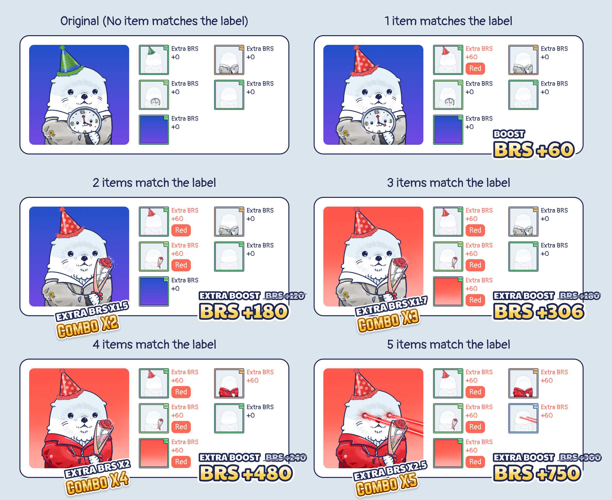
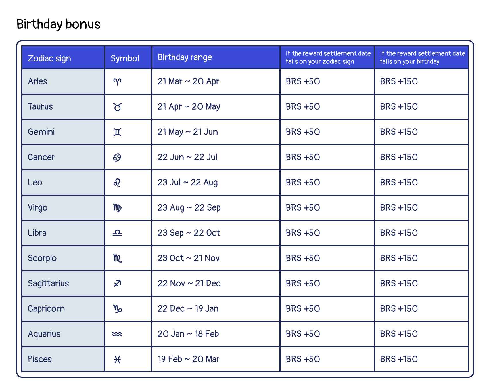

# Rarity Competition - Season 4

<header>
<meta property="og:title" content="Ottopia Whitepaper | Rarity Competition - Season 4" />
<meta property="og:image" content="https://docs.ottopia.app/assets/images/4th-ror-ogimage-32e006d3b21ce4ef3b233ad2e604454c.jpg" />
<meta property="og:description" content="Gather ‘round the stream, Otters! Season 4 of the Rarity Competition is here, and will add another layer of depth to the contest - theme systems and a new bonus mechanism." />
</header>

## Introduction

Attention Otters!

The highly-anticipated fourth season of the Rarity Competition is upon us! Running from April 3rd, 2023 to August 7th, 2023, this season promises to be challenging and exciting with six epochs, each lasting three weeks.

The competition aims to accumulate as many Rarity Score as possible by participating in various activities such as opening themed chests in the [Ottopia Store](../gameplay/store.md), rolling [Dice of Destiny](#dod), and forging new items in the [Ottopia Foundry](../gameplay/foundry.md).

Additionally, the Ottopia Discord server will be hosting various events that offer juicy boost items to help participants increase their rarity score. Be sure to attend these events to gain an advantage in the competition.

It is important to note that this season's reward will be in $MATIC instead of $CLAM tokens. So, gather your $MATIC tokens and get ready to stake, trade, and compete in the fourth season of the Rarity Competition! The top-ranked Otters at the end of the season will receive prizes worth hundreds of dollars at current $MATIC prices.

Don't miss out on the chance to showcase your skills and prove your Rarity prowess!

Shortcuts to each Rarity Competition epoch:

* 6th Epoch (Coming soon)
* 5th Epoch (Coming soon)
* 4th Epoch (Coming soon)
* 3rd Epoch (Coming soon)
* [2nd Epoch - Purple Butterfly Garden Party](#2nd-epoch)
* [1st Epoch - Cybercat City](#1st-epoch)

---

## 2ns Epoch - Purple Butterfly Garden Party 

* Event Duration: Apr 24, 2023 0:00 ~ May 15, 2023 0:00 (UTC)

Hello cherished otters, we are delighted to welcome you to our enchanting Purple Butterfly Flower Garden Party! Immerse yourselves in the breathtaking beauty of blossoming flowers and delightful fluttering butterflies as we celebrate together amidst a sea of purple hues.

During this campaign, you'll have the chance to earn extra Rarity Score and multipliers by styling your Ottos according to the theme requirements of **Purple**, **Flower**, and **Butterfly**. Let the sweet fragrance of blooms and the graceful dance of butterflies sweep you off your feet for an unforgettable visit!

### Rewards

The reward pool for this epoch is **2,000 $MATIC**. Rarity Competition rewards will be shared with only the top 10% of Ottos, so don't miss out!

---

## 1st Epoch - Cybercat City (Ended) 

* Event Duration: Apr 3, 2023 0:00 ~ Apr 24, 2023 0:00 (UTC)

Welcome to the neon-lit streets of Cybercat City, Otters! It's time to immerse yourself in the dark and thrilling world of black cats and cyberpunk. Get ready for an adventure like no other, filled with danger, mystery, and a touch of feline grace.

During this campaign, you'll have the chance to earn extra Rarity Score and multipliers by styling your Ottos according to the theme requirements of **Black**, **Cat**, and **Cyberpunk**. Explore the futuristic cityscape and show off your creativity by designing your Ottos with the edgy, sleek look of a cybercat.

But beware - this is a world of shadows and danger, and only the bravest and most cunning Otters will succeed. So sharpen your claws, don your cyber-enhanced gear, and join us on this thrilling journey through the streets of Cybercat City. Are you ready to take on the challenge?

### Rewards

The reward pool for this epoch is **2,000 $MATIC**. Rarity Competition rewards will be shared with only the top 10% of Ottos, so don't miss out!

The epoch has ended and the top 3 winners are as follows:

(Coming soon)

Click [here](https://ottopia.app/leaderboard?epoch=17) to view the final rarity ranking of all Otto NFTs for this epoch.

---

## How to Play 

Each 3-week epoch will have a different theme, and each theme will have two to three specific item labels that will entitle an item with one or more themed labels to a rarity boost. Item labels can be found when viewing the item in the “My Items” section of the Ottopia app. As long as the player wears an item with a theme-specific label, the player will receive a rarity boost to their Otto.

Here is how the theme rarity boosts are calculated:

- If the item has one theme-specific label, **+60 boost**
- If the item has two theme-specific labels,**+120 boost**
- If the item has three theme-specific labels, **+180 boost**

After adding the scores above, there will be a "set bonus" multiplier added if the Otto is wearing multiple items with a theme-specific label:

- One item with theme-specific labels = **x1 multiplier boost**
- Two items with theme-specific labels = **x1.5 multiplier boost**
- Three items with theme-specific labels = **x1.7 multiplier boost**
- Four items with theme-specific labels = **x2 multiplier boost**
- Five items with theme-specific labels = **x2.5 multiplier boost**

For example, in the image below we see if an Otto is wearing five items, two of which match one label and one item that matches two labels at the same time, the BRS bonus would be calculated as (60+60+120)*1.7 = 408 

In the image below, notice that the rarity of the item itself is still calculated. The final rarity score = Original rarity score (RRS+BRS) + 408 (Extra BRS)

With the new theme system, competitors have even more ways to climb to the top of the rarity leaderboard, and claim those juicy CLAM prizes. You won’t want to miss out!

### Calculating rarity

There are 2 types of rarity scores in play here - Base Rarity Score (for traits and wearable items) & Absolute Rarity Score. In the [Rarity Score page](../gameplay/rarity-farming.md), there is more detailed information that you should learn if you'd like to dig deeper in rarity farming.

## Extra rarity score bonus

Despite the factors listed above, your Otto's birthday and identity may also affect your rarity score!

### Legendary bonus

Every legendary Otto will be blessed with **100 BRS** bonus permanently, but if any Otto's genetic item has been replaced by any other item, the bonus will be removed until the items are set back to the defult.

### Constellation bonus

If the reward settlement date falls on your Otto's constellation, your Otto will receive a **50 BRS** bonus in this epoch! The constellation bonus will reset after each epoch ends.

For example: If the next reward settlement date is May 21, the date falls to Taurus. Every Otto, Lottie and Cleo whose star sign is Taurus will +50 BRS until the next epoch.

### The Chosen Otto bonus

If the reward settlement date falls exactly on your Otto's birthday, it means your Otto is the chosen one! Your Otto will receive a **150 BRS** bonus in this epoch! The constellation bonus will reset after each epoch ends.

For example: If the next reward settlement date is May 21, every Otto, Lottie and Cleo whose birthday is May 21 will +150 BRS until the next epoch. 

> *Note: The birthday bonus cannot combine with the constellation bonus.*

The chart below shows the defined constellation's start/end date, and the bonus rules.

## Other rarity score boost method

Despite of the genetic factors, here the Otter Kingdom also provides a powerful but a bit risky method for the player to boost your Otto's rarity tempararily to improve ranking in the leaderboard:

### Dice of Destiny 

The Dice of Destiny gives players a chance to temporarily boost your BRS for the current epoch in the Raking for Rarity Competition, but there’s a possibility that your Otto will lose some BRS as well.

* Each roll produces a single, randomized result out of dozens of possible results.
* Some of the results have a positive effect on your Otto’s BRS, While some have a negative effect on your Otto’s BRS.
* Some results require an additional selection. Your choice will determine the fate of your Otto.
* The BRS effect from rolling the Dice of Destiny only lasts for the current epoch, and will be removed as soon as it ends.
* The Dice results only affect the Otto you choose to roll a dice for.

The following list shows the percentage of the result types you will get in every single event:

- Good result:	**42.5%**
- Bad result:	**34.5%**
- Options*:	**23.0%**

*Depending on how you answer the question, you might get good or bad results. 

## Rewards

The reward of the Rarity Competition is in $MATIC. We are preparing a total of more than 12,000 $MATIC for this season! Each epoch’s reward will be started from 2,000 $MATIC.

Start gear up your Otto gang and earn these tasty $MATIC!

If you haven’t already minted an Otto from our Genesis Collection, you can do so at the [Ottopia App](http://ottopia.app). For more information about the competition and the Ottopia protocol in general, please swim down to our [Discord](https://discord.gg/jdCk93R2) and say hello!

Until then, OGMI
