# Adventure

<header>
<meta property="og:title" content="Ottopia Whitepaper | Adventure" />
<meta property="og:image" content="https://docs.ottopia.app/assets/images/hero-5be89801c9873fd27a1c718340251ed2.jpeg" />
<meta property="og:description" content="There are different difficulty levels and failure/success rates in each area. The varied terrain, environments, and unknown dangers make it imperative that your Ottos have enough trait advantages to survive." />
</header>

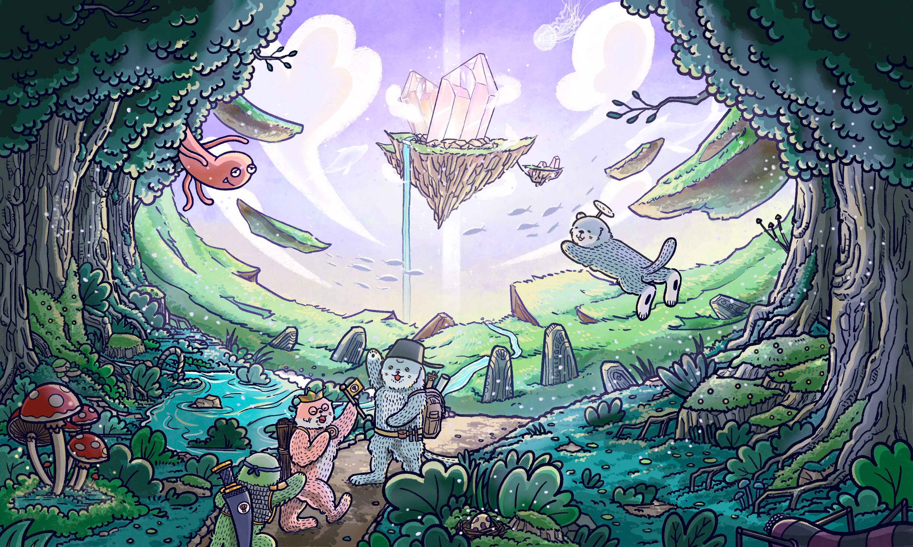

## Introduction

The adventure system is now open! In the adventure system, Ottos can explore a wide variety of adventure areas in Ottopia and discover brand new Mission Items, Collectibles, and Wearable Items only available in specific areas.

There are different difficulty levels and failure/success rates in each area. The varied terrain, environments, and unknown dangers make it imperative that your Ottos have enough trait advantages to survive. In addition to improving Otto's attributes by wearing the appropriate equipment, you can carry special items to increase your chances of success. Your Ottos will earn EXP as they complete their adventures.

## How to play

### TL;DR

1. Choose an activated area on the Adventure map.

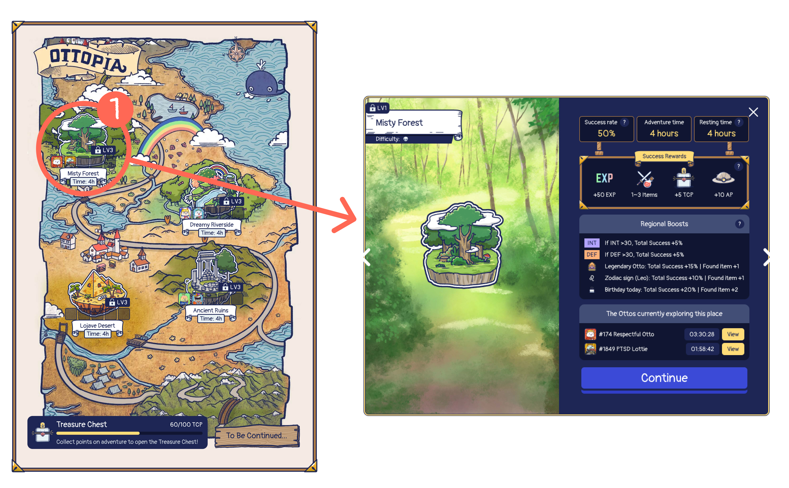

2. Choose an Otto NFT for the adventure.
3. Get dressed with the best wearables.
4. Preview the success rate and expected adventure rewards.
5. Let’s go!

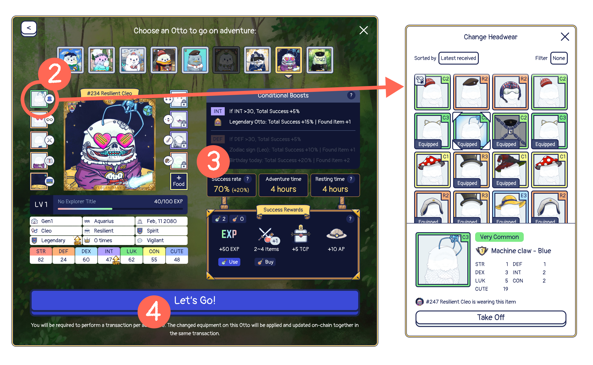

6. When time’s up, come back to check the results of your Otto's adventure.
7. If your Otto succeeded in his adventure, collect your rewards.

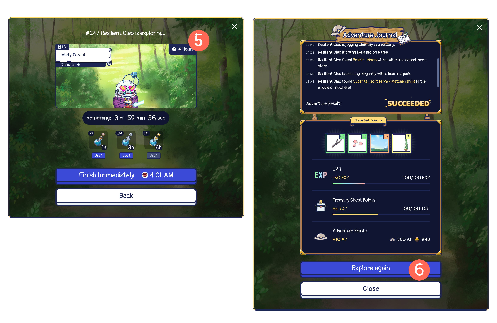

8. Get some rest and prepare for the next adventure!

## Before the Adventure

### 1. Choose an Adventure Area

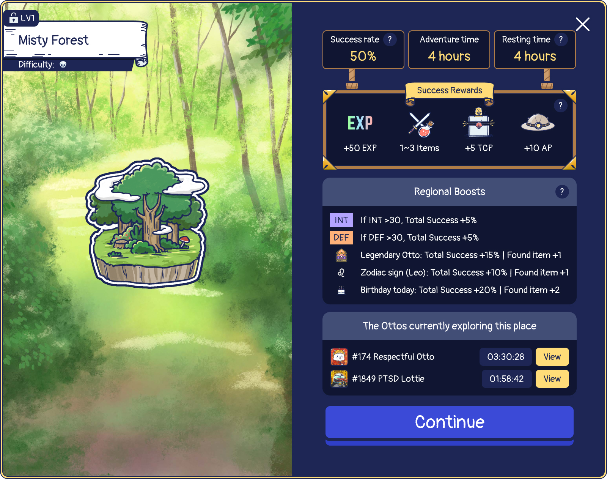

Due to the varied terrain, unpredictable environments, and unknown dangers, each area has a different difficulty and success rate. Your Otto must try hard to improve specific attributes that the area requires in order to survive.

The success rate and the probability of finding an item in an area can be applied to [multiple boosts.](#conditional-boosts)
Choose an area to dig deeper!

### 2. Choose Your Otto NFT

After selecting an area to explore, you can select your Otto NFT to explore this area. Please note that you cannot select an Otto who’s already on another adventure.

#### Gear up your Otto

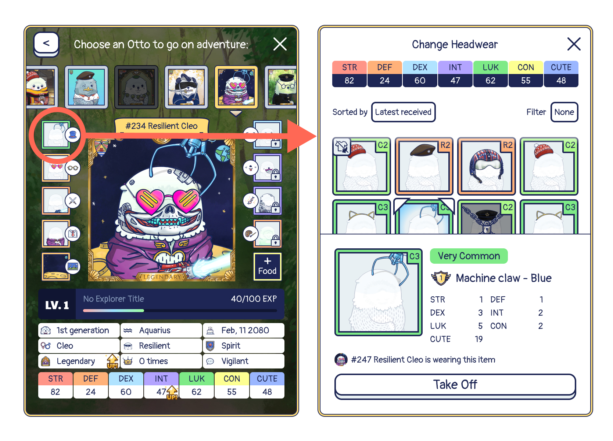

There are several wearable item types you can select to change in this step:

- Holding
- Headwear
- Facial Accessories
- Clothes
- Background

It is possible to select an item already worn by another Otto. The item will be taken off the other Otto and put onto this Otto in the same transaction.

You can change multiple items at once and preview the total attributes in this view without having to perform a transaction. You will be required to execute a transaction to update the wearable items on this Otto only when you click “Let’s Go.”.

_Notice: When the selected Otto is already on another adventure, you cannot remove the wearable item from that Otto._

_Example:_

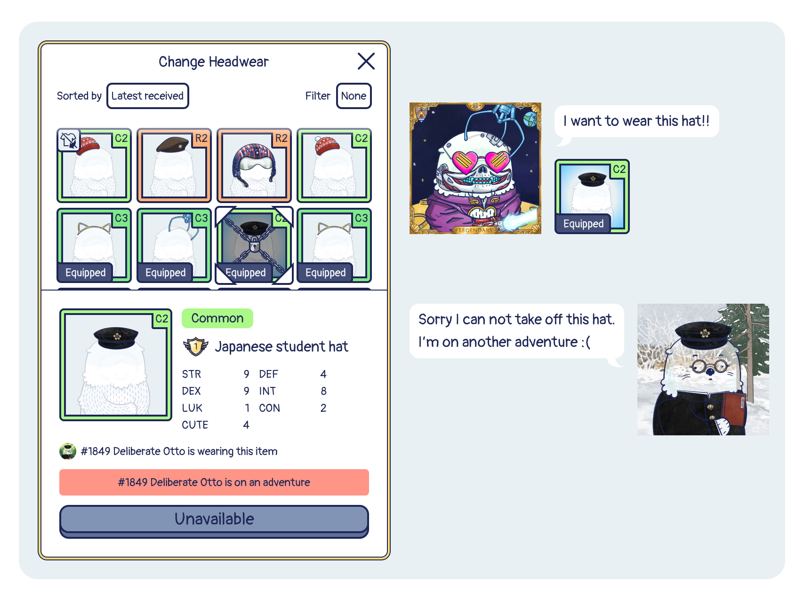

### 3. Preview the Adventure Results

When your Otto successfully completes an adventure, you can get the items that your Otto found and the corresponding [Experience Points (EXP)](#attribute-points--leveling-up), [Treasure Chest Points (TCP)](#treasure-chest-mechanism) and [Adventure Points (AP)](#adventure-points).

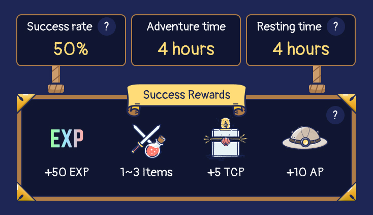

During the preview stage, it is important to check Otto's expected success rate and expected rewards. Read on to learn more about the success rate and rewards.

## Success rate & Rewards 

### Success rate 

The following chart shows the difficulty and estimated rewards from every area available so far in the adventure map:

| Area             | Difficulty | Gained EXP | Success Rate | % to find 1 item | % to find 2 items | % to find 3 items |
| ---------------- | ---------- | ---------- | ------------ | ---------------- | ----------------- | ----------------- |
| Misty Forest     | 💀         | 50         | 50%          | 75%              | 20%               | 5%                |
| Dreamy Riverside | 💀💀       | 80         | 30%          | 65%              | 27%               | 8%                |
| Ancient Ruins    | 💀💀💀     | 150        | 20%          | 60%              | 32%               | 8%                |

### Rewards

When your Otto successfully completes an adventure, you can get the items that your Otto found and the corresponding [Experience Points (EXP)](#attribute-points--leveling-up), [Treasure Chest Points (TCP)](#treasure-chest-mechanism) and [Adventure Points (AP)](#adventure-points).

The range of the rarity of the items you found in your adventure has the following static probabilities:

**Probability of item-drop**

- 70% [Mission Items](#mission-items)
- 20% [Collectibles](#collectibles)
- 10% [Wearable Items](../gameplay/traits.md)

The table below shows the rarity rate of dropped items. This probability is applied to mission items, collectibles, and wearable items.

| Area        | Difficulty | Gained EXP |
| ----------- | ---------- | ---------- |
| Very Common | C3         | 30%        |
| Common      | C2         | 25%        |
| Uncommon    | C1         | 15%        |
| Rare        | R3         | 10%        |
| Super rare  | R2         | 8%         |
| Ultra rare  | R1         | 6%         |
| Epic        | E1         | 3%         |
| Legendary   | E2         | 2%         |
| Mythical    | E1         | 1%         |

Every single item you find corresponds to the probabilities shown in the chart above.

E.g. You found 5 items while on an adventure with your Otto's. Every item has a 30% chance of being a C3 rarity item, and a 70% chance of every item being a Mission item.

If your Ottos meet the adventure area’s special conditions, they will have a higher chance to complete the adventure and have the possibility of finding more items, or even double the EXP from the exploration. Please go ahead to learn more about conditional boosts.

### Conditional boosts 

The following conditions are the most common and recommended ways to increase your Otto’s success rate in adventures:

#### Regional bonus

The different attribute advantages your Otto possesses will significantly affect the chance of success in different regions. Make sure to gear up your Otto to match the condition in that region to enjoy the success rate boost.

**Misty Forest**

| Attribute condition | Success rate boost |
| ------------------- | ------------------ |
| INT ≥ 30            | +5%                |
| INT ≥ 40            | +10%               |
| INT ≥ 50            | +15%               |
| DEF ≥ 35            | +5%                |
| DEF ≥ 45            | +10%               |
| DEF ≥ 55            | +15%               |

**Dreamy Riverside**

| Attribute condition | Success rate boost |
| ------------------- | ------------------ |
| DEX ≥ 50            | +15%               |
| DEX ≥ 60            | +20%               |
| DEX ≥ 70            | +25%               |
| CON ≥ 45            | +15%               |
| CON ≥ 55            | +20%               |
| CON ≥ 65            | +25%               |

**Ancient Ruins**

| Attribute condition | Success rate boost |
| ------------------- | ------------------ |
| STR ≥ 55            | +10%               |
| STR ≥ 65            | +15%               |
| STR ≥ 75            | +20%               |
| STR ≥ 85            | +25%               |
| LUK ≥ 55            | +10%               |
| LUK ≥ 65            | +15%               |
| LUK ≥ 75            | +20%               |
| LUK ≥ 85            | +25%               |

#### Zodiac bonus

Adventure success rate +10%; get 1 extra item

#### The chosen otto bonus

Adventure success rate +20%; get 2 extra items

#### Lengendary bonus

Adventure success rate +30%; get 1 extra item

#### Potions

Play it smart, don’t play it safe. There are some magical potions available in Ottopia that can double your rewards and EXP. You can get them from attending campaigns, staking, or purchasing from the Ottopia store.

Ottos can use Experience Potion to get double EXP or use Strength Potion to double the number of items you collect before starting the adventure.

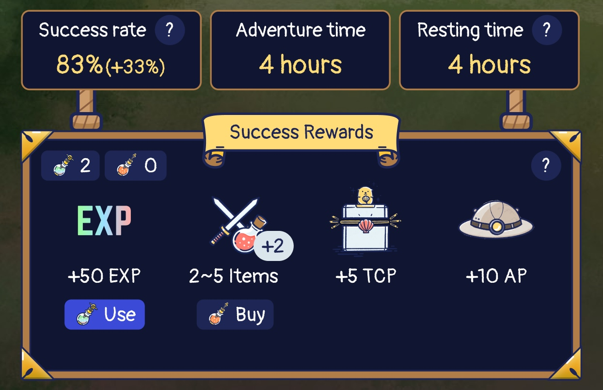

You can check the effect and price of potions in the chart below.

| Image                                    | Name              | Effect                                                                                                              | Price in the Ottopia Store |
| ---------------------------------------- | ----------------- | ------------------------------------------------------------------------------------------------------------------- | -------------------------- |
| 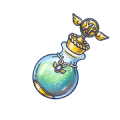 | Experience Potion | This item can be used to double the amount of experience earned for an adventure. It is a one-time consumable item. | 1 $CLAM                    |
| 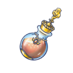   | Strength Potion   | This item can be used to double the amount of items you collect in an adventure. It is a one-time consumable item.  | 2 $CLAM                    |

## During the Adventure

Aftering sending your Otto on an adventure, all you have to do is wait.
But, if you'd like to cast a magic spell to speed up the time, wait no longer!

### Speed up the adventure

There are two methods to speed up an Otto's adventure time:

1. Use [Speedy Potions](#speedy-potion) to accelerate.
2. Use $CLAM to finish immediately.

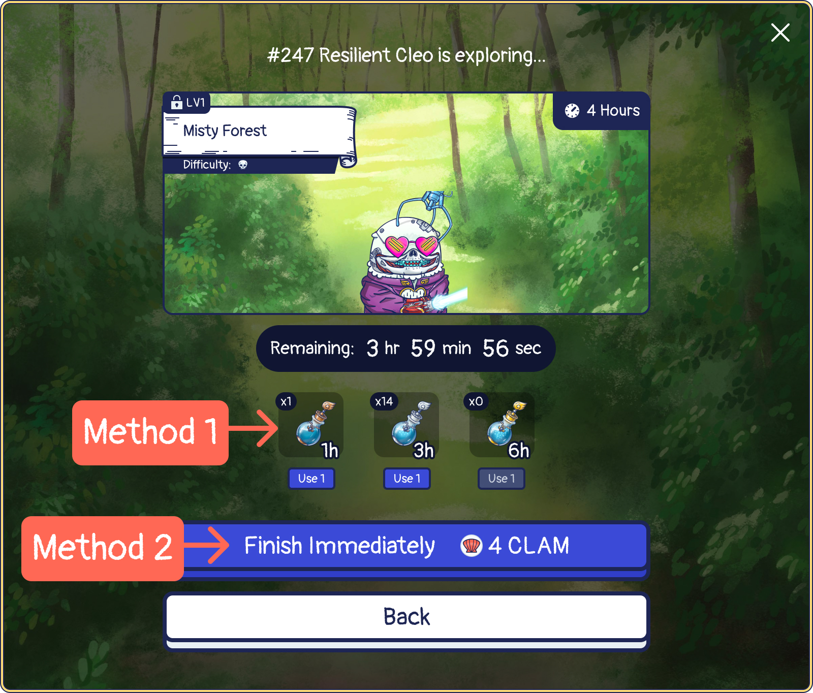

### Speedy Potion 

There are three kinds of speedy potions. You can get them at the store or at community events.

| Image                                       | Name                 | Effect                                                                                                                               | Price in the Ottopia Store |
| ------------------------------------------- | -------------------- | ------------------------------------------------------------------------------------------------------------------------------------ | -------------------------- |
| 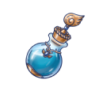 | 1-hour Speedy Potion | After using the potion, you can accelerate the remaining time of the current adventure by 1 hour. It is a one-time consumable item.  | 1 $CLAM                    |
|       | 3-hour Speedy Potion | After using the potion, you can accelerate the remaining time of the current adventure by 3 hours. It is a one-time consumable item. | 2.5 $CLAM                  |
| 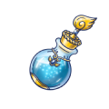 | 6-hour speedy potion | After using the potion, you can accelerate the remaining time of the current adventure by 6 hours. It is a one-time consumable item. | 4 $CLAM                    |

### Spending CLAM by Hour

For example, Otto still has three and a half hours remaining in the adventure, so according to the chart below, it will take Otto 4 $CLAM to finish it immediately.

| Time Remaining (hrs.) | $CLAM |
| --------------------- | ----- |
| >11                   | 15    |
| ≤11                   | 13    |
| ≤10                   | 11    |
| ≤9                    | 9     |
| ≤8                    | 8     |
| ≤7                    | 7     |
| ≤6                    | 6     |
| ≤5                    | 5     |
| ≤4                    | 4     |
| ≤3                    | 3     |
| ≤2                    | 2     |
| ≤1                    | 1     |

## Post-Adventure

### Check the Adventure Results

After finishing the adventure, you can view Otto's adventure journal and confirm the Result: Success or Failure.

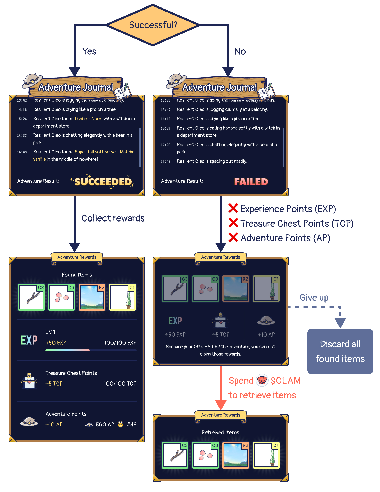

#### Adventure Journal

Adventure journals are simply random sentences chosen from a database of words we have in our generator. Players might see some ridiculous but hilarious events in their journal. Remember to share them with other community members!

If your Otto successfully completes the adventure, you will be able to collect the adventure rewards.

#### If your Otto fails to complete the adventure…

There’s still a specific probability that your Otto fails to complete the adventure (based on the estimated final success rate when you send out Otto’s in the first place). If your Otto fails, you will not gain any Experience Points (EXP), Treasure Chest Points (TCP) nor Adventure Points (AP). You will also lose all of the items you found, but there’s still a way that you can get those precious items back.

### Summon the Kodama

**What are Kodamas?**

Kodamas are Ottopian tree spirits that reside in special trees in ancient forests. Kodama has white skin with black and gray, glowing eyes. Each Kodama has three black dots on their faces to symbolize their eyes and mouth.

You can spend 1 $CLAM to summon a “Kodama" to help you bring back all found items during a failed adventure. Kodamas have a very strong connection to everything in Ottopia, and those cute and adorable spirits will return your items completely and safely. It is a one-time use summon, so if your Otto fails another adventure, you must summon Kodama to help you again.

## Rest

Ottos need to rest after finishing every adventure, whether it’s successful or not.
The resting time differs depending on the adventure time of the area.

Please note that the resting period does not automatically proceed when the adventure time is up. Your Otto's resting time only starts once you have checked and confirmed the previous adventure result.

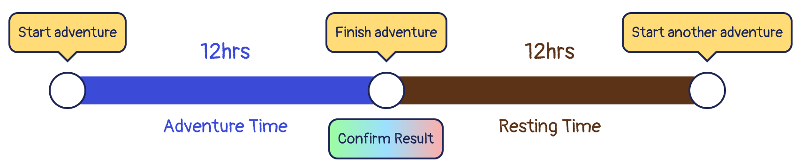

The following chart shows the resting time based on each adventure area:

| Area             | Difficuly | Adventure time | Resting Time |
| ---------------- | --------- | -------------- | ------------ |
| Misty Forest     | 💀        | 4 hrs          | 4 hrs        |
| Dreamy Riverside | 💀💀      | 8 hrs          | 8 hrs        |
| Ancient Ruins    | 💀💀💀    | 12 hrs         | 12 hrs       |

If your Otto levels up during the current adventure, your Otto will be rewarded with a “Cool down time bonus”, which means your Otto’s energy will be fully restored, so you can send your Otto on another adventure immediately without having to rest.

### Speed up the resting time

There are two methods to speed up Otto's resting time:

1. Use Speedy Potion to accelerate.
2. Use $CLAM to finish immediately.

Note: A Speedy Potion that is used to accelerate the adventure time will not also accelerate the resting time.

For example, if you use a 6-hour Speedy Potion on an Otto whose adventure has 3 hrs left (Total adventure time is 12 hrs), the Otto’s adventure time will be finished immediately, but the resting time will not be affected. You still need to wait 12hrs. for the resting period to complete (You can use another potion to speed up, of course).

After resting, your Otto can go on to another adventure!

---

## Attribute points & Leveling up 

After finishing an adventure, Ottos will receive EXP in that area. After gaining enough EXP, Ottos level up. Every time they level up, Ottos can receive two attribute points, and the player can freely assign points as they wish.

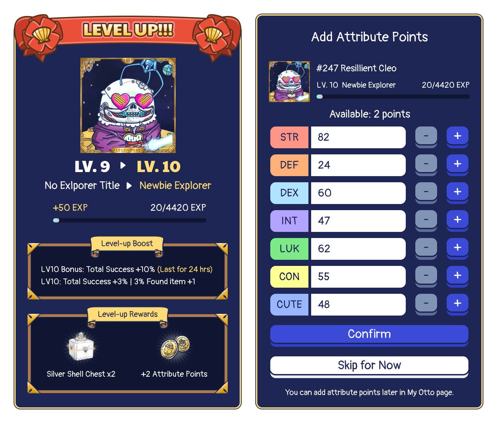

The level-up formula is as follows:

**EXP=30(N\*N+5N)-80（N=current level）.**

For example, an Lv1 Otto only needs 100 EXP to upgrade to Lv2, while an Lv2 Otto needs 340 EXP to upgrade to Lv3; LV3 needs 640 EXP to upgrade to LV4; LV4 needs 1000 EXP to upgrade to LV5.

### Level boost

Each level can enjoy different boosts. You can not only permanently increase the success rate but also have the chance to get more items. The maximum Otto level is currently 25.

| Otto level  | Success rate boost | Adventure item found amount boost | Collectible found amount boost  |
| ----------- | ------------------ | --------------------------------- | ------------------------------- |
| LV1 ~ LV4   | -                  | -                                 | -                               |
| LV5 ~ LV9   | +2%                | +2% to find 1 extra item          | -                               |
| LV10 ~ LV14 | +3%                | +3% to find 1 extra item          | -                               |
| LV15 ~ LV19 | +4%                | +4% to find 1 extra item          | -                               |
| LV20 ~ LV24 | +5%                | +5% to find 1 extra item          | +1% to find 1 extra collectible |
| LV25        | +6%                | +6% to find 1 extra item          | +2% to find 1 extra collectible |

### Level-up bonus

Ottos can get a rest bonus once they level up; or get titles and benefits if they reach the specified level. You can see more details of the level-up bonus below.

| Otto level | Chest rewards   | Success rate boost per Otto (24 hours only) | Adventurer title       |
| ---------- | --------------- | ------------------------------------------- | ---------------------- |
| < LV5      | -               | -                                           | Training Explorer      |
| Reach LV5  | Silver Chest x1 | +5%                                         | Newbie Explorer        |
| Reach LV10 | Silver Chest x2 | +10%                                        | Amateur Explorer       |
| Reach LV15 | Gold Chest x1   | +15%                                        | Knowledgeable Explorer |
| Reach LV20 | Gold Chest x1   | +20%                                        | Experienced Explorer   |
| Reach LV25 | Gold Chest x2   | +25%                                        | Sophisticated Explorer |

### Cool down time bonus

Once an Otto levels up, there will be a rest bonus. That means you don't have to wait for the cool down time and can go to the next adventure directly. For example, if an Otto levels-up from LV1>LV2 and has just returned from the Ancient Ruins, it won't take 12 hours to let the Otto rest.

---

## Mission Items 

The mission items players get from the adventure can be used for missions and for exchanging the specified items by forging them in the Ottopia Foundry.

In addition, players can also use mission items in the cooking system (coming soon), in which players can combine various ingredients to discover secret recipes. The dishes that players complete can give Ottos extra boosts in the adventure.

---

## Collectibles 

Collectibles found from adventures can be displayed in [My Gallery](#my-gallery) in the future.

There are two types of Collectibles:

- [Adventure Momentos](#adventure-momentos)
- [Artwork](#artwork)

## Adventure Momentos 

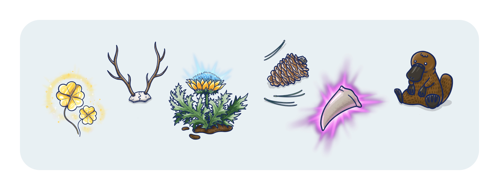

You can regard an Adventure Momento as a souvenir from the adventure. Your Otto cannot equip it, but it plays an important role in your lifestyle. The more Adventure Momento displayed in [My Gallery](#my-gallery), the more Civilization Points (CP) you will gain.

## Artwork 

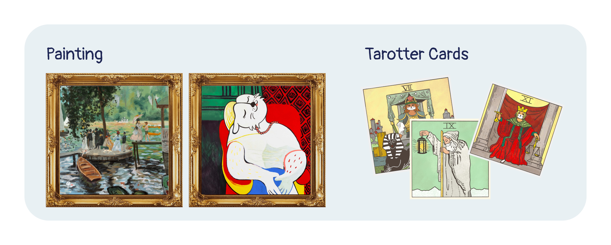

There are a number of artworks created by Ottorei - one of the most notable artists in Ottopia. Ottorei painted numerous masterpieces during her lifetime, but most of them were destroyed by mysterious disasters or have been stolen.

Now, some of these artworks can be found as pieces called Artwork Fragments. You will have to collect a specific number of pieces in order to reassemble the original artwork.

There are six rarity levels of Artwork Fragments: R3, R2, R1, E3, E2, and E1. Once you collect a specified number of pieces, you can forge them and return them to a piece of artwork with a corresponding rarity level at the Ottopia Foundry.

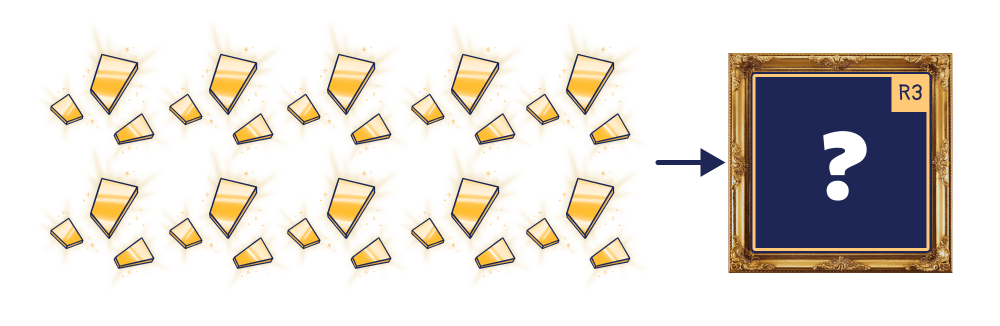

The following chart shows the number of Artwork Fragment needed to recreate the original Artwork:

| Rarity | Artwork Fragment                                       | Artwork Fragment needed | Result        |
| ------ | ------------------------------------------------------ | ----------------------- | ------------- |
| R3     | 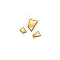 | 10                      | R3 Artwork x1 |
| R2     | 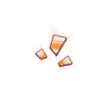 | 9                       | R2 Artwork x1 |
| R1     | 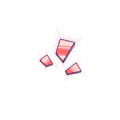 | 8                       | R1 Artwork x1 |
| E3     | 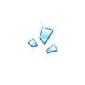 | 7                       | E3 Artwork x1 |
| E2     | 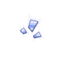 | 6                       | E2 Artwork x1 |
| E1     | 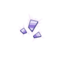 | 5                       | E1 Artwork x1 |

---

## Treasure Chest Mechanism 

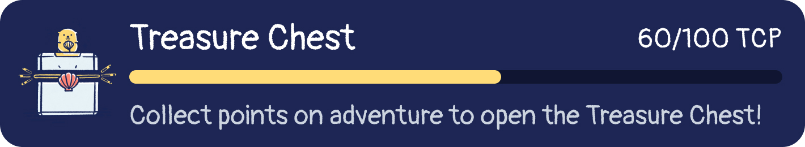

Once the adventure is complete, players can get Treasure Chest Points (TCP). Once you collect 100 TCP, you will get a limited edition Treasure Chests in the adventure system. There are some special items in the Treasure Chest that players cannot find elsewhere.

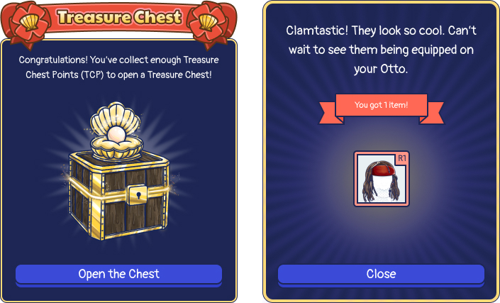

You can get different treasure points in different adventure areas as follows.

| Area Difficulty | Treasure Chest Points (TCP) |
| --------------- | --------------------------- |
| 💀              | 5                           |
| 💀💀            | 10                          |
| 💀💀💀          | 15                          |
| 💀💀💀💀        | 20                          |
| 💀💀💀💀💀      | 30                          |

A Treasure Chest contains a wearable item. There’s a 16% chance of finding exclusive wearable items that you can not find anywhere else! To learn more about the rarity % in a Treasure Chests, please refer to the chart below:

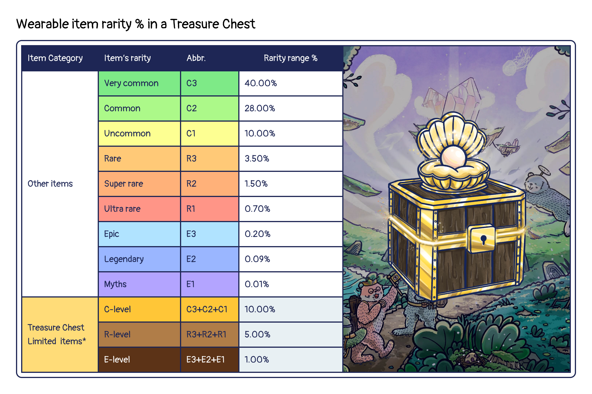

---

## Missions 

The maximum number of missions each player can have depends on the number of Ottos. One Otto and two Ottos are both capped at 2.

Initially, you will be given two free missions (per wallet). After that, you can collect one mission for free at 00:00 (UTC) each day. If you want to get more missions, you need to spend 1 $CLAM. (ONE $CLAM for ONE mission.)

Remember, free missions must be collected online daily and will automatically disappear if not collected.

Let's look at the following example:

1. If you have five Ottos, you can simultaneously have up to five missions. However, you will not be able to receive any free missions until you complete any of them.

2. The player has ten Ottos. After deducting the initial two missions and today's free one, you can still buy up to seven new missions with $CLAM. However, the maximum number of missions is 10. Before the player finishes any of it, he cannot get another free one or buy missions with $CLAM.

| # Ottos in Wallet | Maximum Missions |
| ----------------- | ---------------- |
| 1                 | 2                |
| 2                 | 2                |
| 3                 | 3                |
| 4                 | 4                |
| ...               | ...              |
| 10                | 10               |
| 11                | 11               |
| 12                | 12               |
| ...               | ...              |

### Mission Level

There are five levels of missions, S/A/B/C/D. The probability of receiving different levels of missions is as follows.
S rate: 3% ｜ A rate: 7% ｜ B rate: 15% ｜ C rate: 30% ｜ D rate: 45%

The higher the mission level, the lower the success rate but the better the reward.

---

## Adventurer Leaderboard 

There are two types of adventurer leaderboards, "most completed missions'' and "most completed adventures." The award rules are the same as Rarity Leaderboard. Time to play and earn!

### Most Completed Missions

The leaderboard links directly to a user’s wallet. The more missions you complete, the higher your ranking will be. The leaderboard will reset every two weeks.

### Most Completed Adventures

The more adventure points your Otto gets, the higher its ranking on the leaderboard. The leaderboard will reset every two weeks.

### Adventure Points 

Each area can get different Adventure Points (AP) as shown below.

| Area Difficulty | Adventure Points (AP) |
| --------------- | --------------------- |
| 💀              | 10                    |
| 💀💀            | 20                    |
| 💀💀💀          | 40                    |
| 💀💀💀💀        | 60                    |
| 💀💀💀💀💀      | 80                    |

Adventure Points (AP) can be the score in the adventure ranking competition. The higher your Otto rank, the more rewards you'll receive, so assess your risk tolerance and embark on your adventure! Adventure Points will be erased and reset after the end of each epoch of adventure ranking competition.

The adventure ranking competition will be announced on Discord. Please join us on Discord to keep posted.

---

## My Gallery 

Collectibles you get from the adventure will be displayed in "My Gallery." The more collectibles you have, the higher your [Civilization Points (CP)](#civilization-points) will be.

### Civilization Points 

Civilization Points (CP) can be used in various competitions in the future to give your Otto some advantages. Stay tuned!
