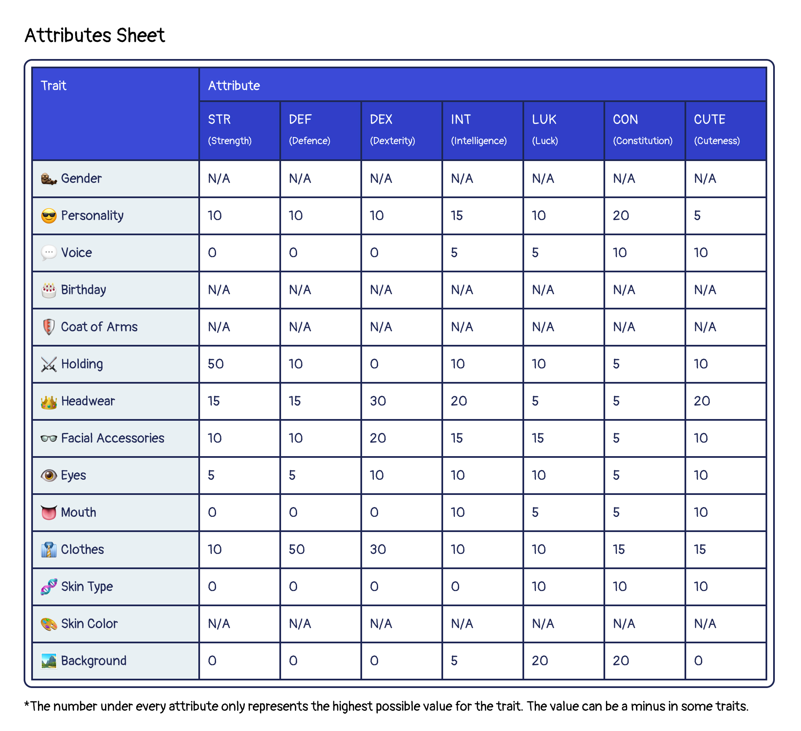

# Attributes

Attributes represent the ability of each Otto, Cleo, and Lottie NFT. What are attributes for? Attributes are used to assist in completing missions to find Ottopia. Each mission has its own attributes requirements. To complete the mission and find Ottopia, you need to train your Otto, gear it up, and team up with others.

Ottos, Cleos, and Lotties all have the following attributes:
- **STR** Strength
- **DEF** Defense
- **DEX** Dexterity
- **INT** Intelligence
- **LCK** luck
- **CON** Constitution
- **CUTE** Cuteness

The DAO may decide to develop more attributes.

The maximum value of an attribute varies across different types of traits.
The chart below shows how it works:

