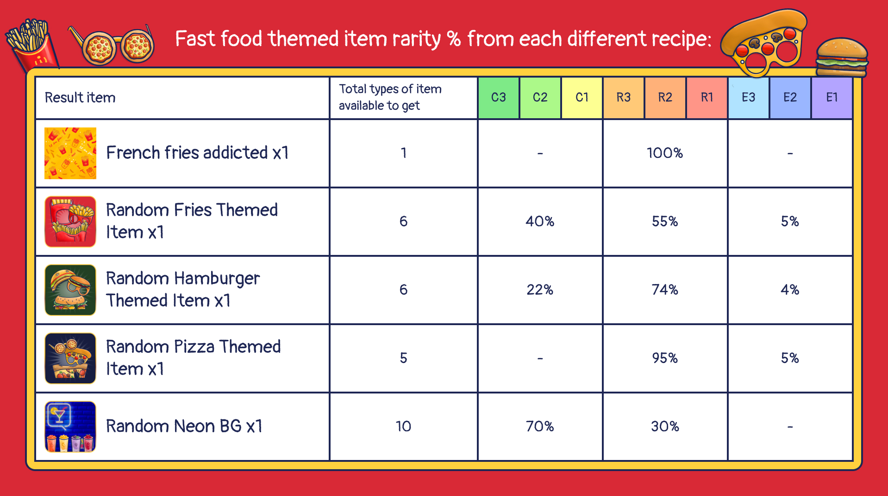

# Foundry

<header>
<meta property="og:title" content="Ottopia Whitepaper | Foundry" />
<meta property="og:image" content="https://docs.ottopia.app/assets/images/foundry_hero-dd565246776227bfab18e87db8b3945a.jpg" />
<meta property="og:description" content="The Otter Kingdom has its own Ottopia Foundry. Here, you can melt several items to create a new item with the possibility of getting a higher rarity score or better attributes!" />
</header>

## Ottopia Foundry 
The Otter Kingdom has its own Ottopia Foundry. Here, you can melt several items to create a new item with the possibility of getting a higher rarity score or better attributes!

To forge a new item, you'll have to collect all of the necessary items that are required and then re-forge them with the new **$FISH** token.  Recipes will continuously be added and some of them will only be available in the Foundry for a limited amount of time, not only that, but there may even be chances to forge Epic+ items! 

So, Ottopians, make sure you keep an eye on the Foundry so you don't miss out!

## $FISH token

Many of you have noticed the new "fish" token that made appearances in a few of the alpha screenshots...well now the $FISH token is here! 🐟 

## What is $FISH?

The $FISH token can only be used within the Ottopia website. This token will be used on features like the Foundry and potentially some future games!

## Seasonal recipe  

### Let's get some Fast Food! (Ended)

As part of our latest theme of Rarity Ranking Competition, and for a limited time only, we're introducing Fast Food Themed Recipes. These recipes contain a bunch of tasty fast food like pizza, french fries and hamburgers. 

As an Ottopian, you will randomly get 1 items that will help you get tasty and swaggy Fast Food props from the Foundry! You can also open Fast Food Themed Chests to collect recipe items to forge a rare item at the Foundry.

So let’s get to it, Ottopians! Head on over to the Ottopia Foundry and deck your NFTs out in your best "Fast Food" + "Food" + "Yellow/Golden" gear!

This chart shows the probability of halloween items categorized in different rarities by recipe:

### Trick or Treat! (Ended)

As part of the Rarity Competition S2 3rd epoch, every Otto NFT will be receiving a halloween recipe material. You will randomly get 1 of 7 items: Magic pots - White / Red / Orange / Green / Blue / Purple, or a Pumpkin. These items will help you get spooky and swaggy Halloween decorations from the Foundry!

So let’s get to it, Ottopians! Head on over to the Ottopia Foundry and deck your NFTs out in your best "Halloween" + "Orange" + "Spooky" gear!

This chart shows the probability of halloween items categorized in different rarities by recipe:

### Green Up Your Thumb! (Ended)

As part of the Rarity Competition S2 2nd epoch, every Otto NFT will be receiving some gardening supplies. You will randomly get 1 of 3 items: Plastic Watering Can - Red, Gardening Tools - Common Trowel, or Houseplant - Common Plastic Pot (S). These items will help you cultivate and grow new plants from the Foundry!

So let’s get to it, Ottopians! Head on over to the Ottopia Foundry and deck your NFTs out in your best "Green" + "Plant" gear!

This chart shows the probability of cultivating plants of different rarities with different Seed Sacks:

