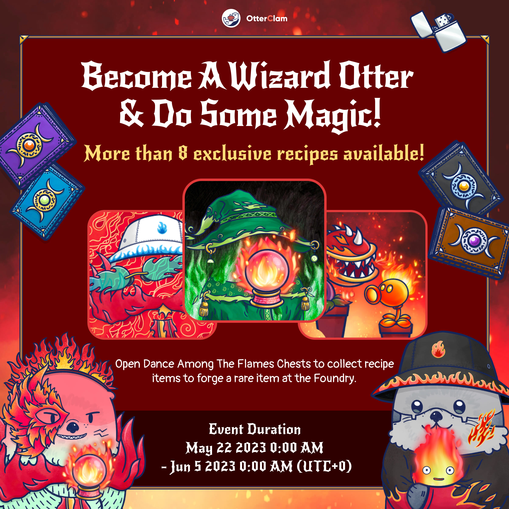

# Foundry

<header>
<meta property="og:title" content="Ottopia Whitepaper | Foundry" />
<meta property="og:image" content="https://docs.ottopia.app/assets/images/foundry_hero-dd565246776227bfab18e87db8b3945a.jpg" />
<meta property="og:description" content="The Otter Kingdom has its own Ottopia Foundry. Here, you can melt several items to create a new item with the possibility of getting a higher rarity score or better attributes!" />
</header>

## Ottopia Foundry 
The Otter Kingdom has its own Ottopia Foundry. Here, you can melt several items to create a new item with the possibility of getting a higher rarity score or better attributes!

To forge a new item, you'll have to collect all of the necessary items that are required and then re-forge them with the new **$FISH** token.  Recipes will continuously be added and some of them will only be available in the Foundry for a limited amount of time, not only that, but there may even be chances to forge Epic+ items! 

So, Ottopians, make sure you keep an eye on the Foundry so you don't miss out!

## $FISH token

Many of you have noticed the new "fish" token that made appearances in a few of the alpha screenshots...well now the $FISH token is here! 🐟 

## What is $FISH?

The $FISH token can only be used within the Ottopia website. This token will be used on features like the Foundry and potentially some future games!

## Seasonal recipe  

### 2023: A Space Ottyssey (Ended)

Buckle up, fellow Ottronauts, and get ready for an unforgettable expedition into the cosmos. Welcome to the "Space Ottyssey" party - your adventure among the stars begins now!

This chart shows the probability of themed items categorized in different rarities by recipe:

In addition to that, we've added 6 fancy Nanoplanet Collectibles that you can find in the adventure! These Nanoplanet collectibles are extremely useful for the Foundry recipes, so don't let this opportunity pass you by!

The finding probability of Nanoplanet Collectibles have been boosted during the 4th epoch of RoR Season 4:

Jun 12th 2023, 0:00:00 ~ Jun 26th 2023, 0:00:00 (UTC+0)

After the end time. the collectibles in each adventure area will be back to normal.

### Dance Among the Flames (Ended)

Prepare to ignite the field with fervor! We present to you a new flame / magical collection. Accumulate all the necessary materials, and you'll have one of them!

This chart shows the probability of themed items categorized in different rarities by recipe:

In addition to that, we've added 6 beautiful Healing Crystal Collectibles that you can find in the adventure! These Healing Crystal collectibles are extremely useful for the Foundry recipes, so don't let this opportunity pass you by!

The finding probability of Healing Crystal Collectibles have been boosted during the 3rd epoch of RoR Season 4:

May 22nd 2023, 0:00:00 ~ Jun 5th 2023, 0:00:00 (UTC+0)

After the end time. the collectibles in each adventure area will be back to normal.

### Butterfly Garden Party (Ended)

We are delighted to welcome you to our enchanting Purple Butterfly Flower Garden Party! Immerse yourself in the breathtaking beauty of blossoming flowers and delightful fluttering butterflies.

This chart shows the probability of themed items categorized in different rarities by recipe:

In addition to that, we've added 9 brand new Butterfly Collectibles that you can find in the adventure! These Butterfly collectibles are extremely useful for the Foundry recipes, so don't let this opportunity pass you by!

The finding probability of Butterfly Collectibles have been boosted during the 2nd epoch of RoR Season 4:

May 1st 2023, 0:00:00 ~ May 15th 2023, 0:00:00 (UTC+0)

After the end time. the collectibles in each adventure area will be back to normal.

### Cybercat City (Ended)

Welcome to the neon-lit streets of Cybercat City, Otters! It's time to immerse yourself in the dark and thrilling world of black cats and cyberpunk. Prepare your Cat teaser and Glow stick, and let's get some awesome cat-themed items!

Surviving in this Cybercat city requires blending in, staying aware, investing in enhancements, and learning self-defense. Here we have some high-tech equipment to increase your chances of thriving in this challenging environment. Just bring on the required materials, and we will give what you need.

This chart shows the probability of themed items categorized in different rarities by recipe:

### Clambow Carnival (Ended)

Welcome everyone to the Clambow Carnival party in Otter Kingdom! Get ready to experience a world of color and joy as we celebrate together under the rainbow. Don't forget to bring your appetite for adventure and your love for fun, as we'll have a variety of activities and games for all ages. And if you're lucky, you might even find a shining clam at the party! So come one, come all, and let's make this carnival a day to remember!

Are you ready to embrace the joyful Clambow Carnival? Head on over to the Ottopia Foundry and deck your NFTs out in your best "Rainbow" + "Clam" + "Carnival" items. Let's make this incredible holiday the most joyful and unforgettable ever!

This chart shows the probability of themed items categorized in different rarities by recipe:

### Blue Island Holiday (Ended)

Our blue island vacation is just around the corner, so get your swimsuit and luggage ready! 

The Otter Kingdom Foundry is offering some super popular blue holiday items for a limited time. Prepare all the materials and FISH, and you'll get these cool things!

As an Ottopian, you will randomly get 1 item that will help you get those pinky cute props from the Foundry! You can also open Sakura Love Chests or Gardening Kit Chest to collect recipe items to forge a rare item at the Foundry.

Are you ready to embrace blue island holiday? Head on over to the Ottopia Foundry and deck your NFTs out in your best "Blue" + "Oceanic" + "Resort" items. Let's make this incredible holiday the most joyful and unforgettable ever!

This chart shows the probability of themed items categorized in different rarities by recipe:

### Sakura Love Story (Ended)

Happy Valentine's Day to all the otters! Wishing all couples a bright future together. With Sakura in full bloom, we have prepared many romantic items to help you celebrate this season of love. It's okay even if you're single. Your Ottopian family will always be there for you. We are your Valentine!

As an Ottopian, you will randomly get 1 item that will help you get those pinky cute props from the Foundry! You can also open Sakura Love Chests or Gardening Kit Chest to collect recipe items to forge a rare item at the Foundry.

Are you ready to embrace the magical Sakura season? Head on over to the Ottopia Foundry and deck your NFTs out in your best "Pink" + "Sakura" + "Valentine's Day" items. May the magic of this romantic season be with you always!

This chart shows the probability of themed items categorized in different rarities by recipe:

### Rabbit New Year (Ended)

Let's dress up your Ottos with brand-new red props!

As an Ottopian, you will randomly get 1 item that will help you get those twinkling props from the Foundry! You can also open Rabbit New Year Chests or Gardening Kit Chest to collect recipe items to forge a rare item at the Foundry.

So let’s get to it, Ottopians! Head on over to the Ottopia Foundry and deck your NFTs out in your best "Lunar New Year" + "Rabbit" + "Red" gear. May the magic of the lunar new year be with you always!

This chart shows the probability of themed items categorized in different rarities by recipe:

### White Ottermas (Ended)

As part of our latest theme of Rarity Ranking Competition and for the celebration of Ottermas, we're introducing new themed recipes. There are a bunch of special stuffs included in these recipes, from the most basic costumes to the most festive and epic items.

As an Ottopian, you will randomly get 1 item that will help you get those twinkling props from the Foundry! You can also open White Ottermas Chests or go on the adventures to collect recipe items to forge a rare item at the Foundry.

So let’s get to it, Ottopians! Head on over to the Ottopia Foundry and deck your NFTs out in your best "Christmase" + "Winter" + "White" gear!

This chart shows the probability of themed items categorized in different rarities by recipe:

### Pharaoh's Secret (Ended)

As part of our latest theme of Rarity Ranking Competition and Adventure Leaderboard, we're introducing new themed recipes. There are a bunch of special stuffs included in these recipes, from the most basic exploring equipment to the most luxurious items found from the ancient Egyptian empire.

As an Ottopian, you will randomly get 1 item that will help you get those twinkling props from the Foundry! You can also open Pharaoh's Secret Chests to collect recipe items to forge a rare item at the Foundry.

So let’s get to it, Ottopians! Head on over to the Ottopia Foundry and deck your NFTs out in your best "Earth Tone" + "Adventure" + "Egyptian" gear!

This chart shows the probability of themed items categorized in different rarities by recipe:

### Happy Clamsgiving! (Ended)

**Clamsgiving Cornucopia**

Similar to Demeter, the goddess of harvest, Ottopians have a cornucopia of their own. At Clamsgiving, Ottopians decorate their cornucopia with fruits and autumn-themed elements; and of course, a big bowl of clams!

It has been said that having this on hand will give you a major advantage in the upcoming competition. Get one for yourself!

**Clamsgiving Turkey Dish**

This dish is one of Ottopia's most notable dishes. At Clamsgiving, Ottopians prepare this turkey dish and share this meal with the family. The specialty is clams. During the roasting process with turkey at high heat, the arona spreads out, doubling the flavor of the clam. 

It has been said that having this on hand will give you a major advantage in the upcoming competition. Make this tasty dish now!

Share the joy and blessing in this big and warm Ottopia family!

### Let's get some Fast Food! (Ended)

As part of our latest theme of Rarity Ranking Competition, and for a limited time only, we're introducing Fast Food Themed Recipes. These recipes contain a bunch of tasty fast food like pizza, french fries and hamburgers. 

As an Ottopian, you will randomly get 1 item that will help you get tasty and swaggy Fast Food props from the Foundry! You can also open Fast Food Themed Chests to collect recipe items to forge a rare item at the Foundry.

So let’s get to it, Ottopians! Head on over to the Ottopia Foundry and deck your NFTs out in your best "Fast Food" + "Food" + "Yellow/Golden" gear!

This chart shows the probability of fast food items categorized in different rarities by recipe:

### Trick or Treat! (Ended)

As part of the Rarity Competition S2 3rd epoch, every Otto NFT will be receiving a halloween recipe material. You will randomly get 1 of 7 items: Magic pots - White / Red / Orange / Green / Blue / Purple, or a Pumpkin. These items will help you get spooky and swaggy Halloween decorations from the Foundry!

So let’s get to it, Ottopians! Head on over to the Ottopia Foundry and deck your NFTs out in your best "Halloween" + "Orange" + "Spooky" gear!

This chart shows the probability of halloween items categorized in different rarities by recipe:

### Green Up Your Thumb! (Ended)

As part of the Rarity Competition S2 2nd epoch, every Otto NFT will be receiving some gardening supplies. You will randomly get 1 of 3 items: Plastic Watering Can - Red, Gardening Tools - Common Trowel, or Houseplant - Common Plastic Pot (S). These items will help you cultivate and grow new plants from the Foundry!

So let’s get to it, Ottopians! Head on over to the Ottopia Foundry and deck your NFTs out in your best "Green" + "Plant" gear!

This chart shows the probability of cultivating plants of different rarities with different Seed Sacks:

