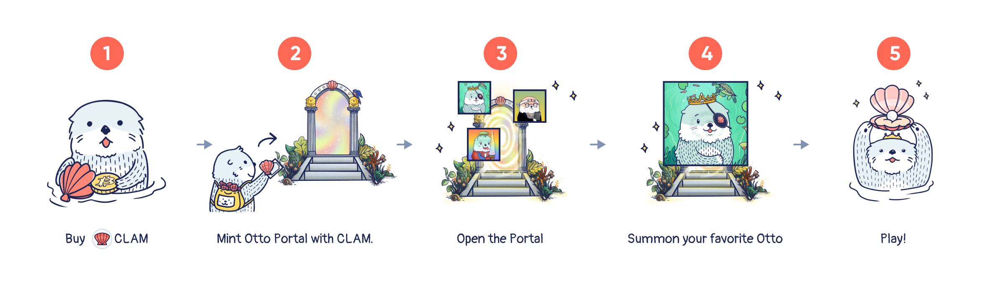

# Getting Started

Now that you have decided to explore Ottopia, here are some quick steps you can follow:

## 1. Buy CLAM

In Otter Kindgom, we use CLAM as the formal currency, so you must have some CLAM tokens in your wallet!

How to buy CLAM? check this page: [How to Buy and Stake CLAM](../../treasury/tutorials/how-to-buy-and-stake-clam)

## 2. Mint Portal

There are only 5,000 Portals generated in Otter Kingdom, which means only 5,000 otters can join this world.
To enter the Otterverse and find the floating island, you must generate a portal. When you mint, you’re effectively buying a portal NFT. In the game, buying the portal represents your entry into the Otterverse, where your mission begins.

- [Buy Portal](https://ottopia.app/mint)
- [Learn more about portal NFT](./portals)

## 3. Open Portal

After getting a portal NFT, you need to open it. It is possible that you get more than 1 Otto candidates at the portal, but you can only choose 1 to get through the portal and formally become an Otto citizen in the Otter Kingdom. Choose wisely!

- [Learn more about portal NFT](./portals)

## 4. Summon your Otto NFT

After choosing your favorite one, summon the Otto NFT! The portal NFT will be replaced with the Otto appearance you choose. Now you have your own Otto NFT. Cangrats!

## 5. Play!

There are several ongoing and upcoming campaigns that you can participate to enhance your Otto NFT and even win the rewards! Please continue to read through in the following pages and you'll be more clear how to go on in this wonderful world.

Join [OtterClam Discord](https://discord.gg/otterclam) to get updated on events and news!
