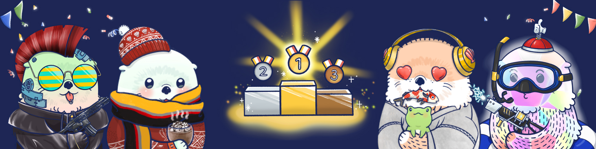
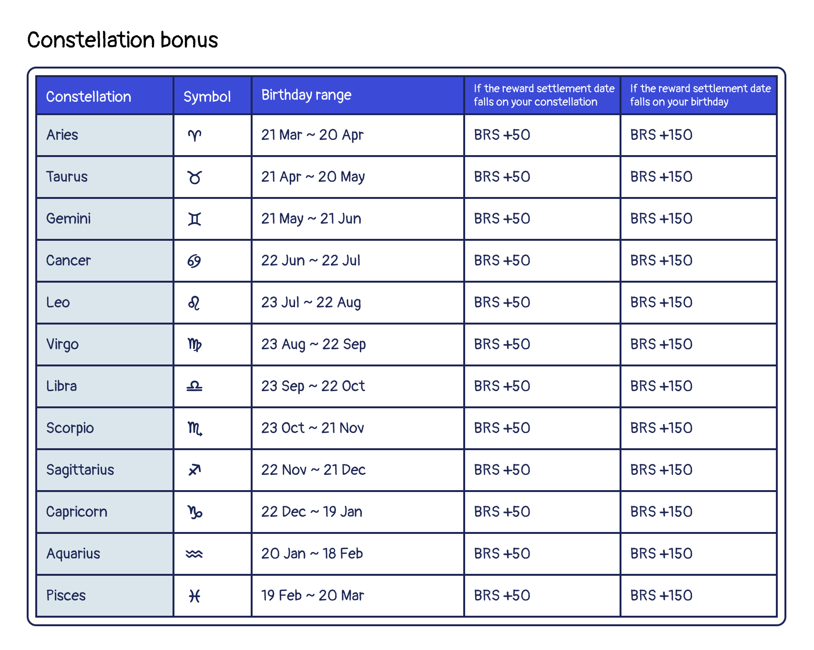
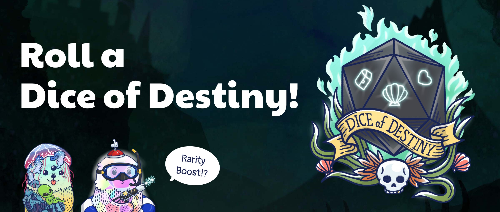

# Leaderboard

A portion of the revenue generated by the Otto NFT ecosystem will go to the reward pool of the leaderboard! Each Otto has its own unique traits and the Ottos with the most unique traits will be rewarded. 

Once the first Genesis Otto enters the Otterverse through the portal, the leaderboard will show up along with the rarity score. CLAMs will be distributed in the reward pool to the top 50% of Ottos based on different categories from each leaderboard. 

The first category of farming will be: **Rarity score leaderboard**. 

The experience and attributes leaderboard will be introduced in future phase.

## Rarity Leaderboard

### Introduction

> The 1st season of Rarity Competition has ended on Aug 19, 2022 (0:00 UTC). For the next competition season, please follow our Discord to keep posted.

Inspired by Aavegotchi, Otter King also develop a unique rarity farming system. It strives to reward the users who are the most thoughtfully and enthusiastically engaged with the ecosystem. As its name suggests, this is a process where you attempt to raise the rarest Otto, Lottie or Cleo, and get rewarded for doing so.

This page will explain how you can engage in rarity farming, and how the rarest Otto NFT are determined. Keep reading to learn more!

### How to play

There are several ways you can engage in the rarity farming exercise. These include:

- Carefully selecting your Otto NFT with rare traits during the summoning process (you can post the images on community to ask for suggesitons eventhough the rarity scores are not revealed before summon. This is what makes the summon process fun, right?)
- Equipping wearables to modify the traits of your Otto NFT
 - By now you can purchase [Shell Chests](./store#shell-chest) to get wearable equipment to enhance your Otto NFT!
- Engaging in games and missions

That said, the rarity level of a single Otto NFT is dynamic and will change over time, as the distribution of traits and wearables in the Otterverse changes. In other words, it isn't enough to simply max out a particular trait in your Otto NFT. You also have to consider the actions of other players. For instance, if too many players try to grind it out for a Epic (E3) rifle with high Base Rarity Score (BRS), this trait becomes less rare, and its Relative Rarity Rcore (RRS) decreases, and then your Otto's rarity level will inevitably go down.

### Calculating rarity

There are 2 types of rarity scores in play here - Base Rarity Score (for traits and wearables) & Absolute Rarity Score. In the [Rarity Score page](./rarity-farming.md), there is more detailed information that you should learn if you'd like to dig deeper in rarity farming.

### Extra rarity score bonus

Despite the factors listed above, your Otto's birthday and identity may also affect your rarity score!

#### Legendary bonus

Every legendary Otto will be blessed with **100 BRS** bonus permanently, but if any Otto's genetic trait has been replaced by any other trait, the bonus will be removed until the traits are set back to the defult.

#### Constellation bonus

If the reward settlement date falls on your Otto's constellation, your Otto NFT will receive a **50 BRS** bonus in this epoch! The constellation bonus will reset after each epoch ends.

For example: If the next reward settlement date is May 21, the date falls to Taurus. Every Otto, Lottie and Cleo whose star sign is Taurus will +50 BRS until the next epoch.

#### The Chosen Otto bonus

If the reward settlement date falls exactly on your Ottt's birthday, it means your Otto is the chosen one! Your Otto NFT will receive a **150 BRS** bonus in this epoch! The constellation bonus will reset after each epoch ends.

For example: If the next reward settlement date is May 21, every Otto, Lottie and Cleo whose birthday is May 21 will +150 BRS until the next epoch. 

> *Note: The birthday bonus cannot combine with the constellation bonus.*

The chart below shows the defined constellation's start/end date, and the bonus rules.

### Other rarity score boost method

Despite of the genetic factors, here the Otter Kingdom also provides a powerful but a bit risky method for the player to boost your Otto's rarity tempararily to improve ranking in the leaderboard:

#### Dice of Destiny 

The Dice of Destiny gives players a chance to temporarily boost your BRS for the current epoch in the Raking for Rarity Competition, but there’s a possibility that your Otto will lose some BRS as well.

* Each roll produces a single, randomized result out of dozens of possible results.
* Some of the results have a positive effect on your Otto’s BRS, While some have a negative effect on your Otto’s BRS.
* Some results require an additional selection. Your choice will determine the fate of your Otto.
* The BRS effect from rolling the Dice of Destiny only lasts for the current epoch, and will be removed as soon as it ends.
* The Dice results only affect the Otto you choose to roll a dice for.
