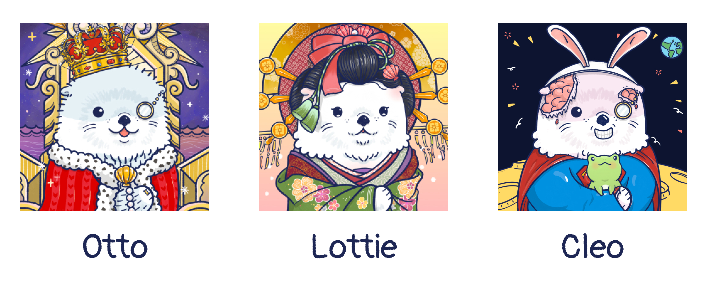
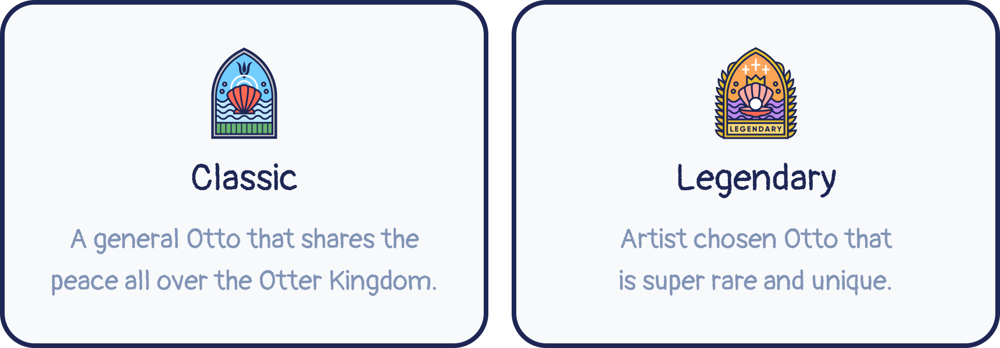

# Otto NFT

## Meet Otto!
> The First Citizens of the Otter Kingdom

Otto NFT has unique features and will be valued accordingly. This feature of ERC-721 tokens is what differentiates them from ERC-20 tokens, which are equal in terms of value, and therefore identical and interchangeable.

Otto NFT is breedabl, stakeable and loveable! Ottos from the Genesis Collection are not only the cutest otters in the kingdom, they also have exclusive privileges. Wanna know more? Check out more details in this page.

## Genders of Otto NFT 

There are totally 5,000 Otto pioneers that will get into the Otterverse to find the Ottopia. Those 5,000 new-coming citizens are recognized as 1st generation. Currently, Otto NFT can be found in Otterverse as three different genders, namely **Otto**, **Lottie** and **Cleo**.

### Otto
There are 1,950 of these otterly handsome fellows. They don't just jazz up your online profiles, they are part of the genesis release, capable of breeding otter pups to increase the kingdom's otter population.

Total population: 1,950

### Lottie
2,950 female Ottos make these NFTs a bit more enticing than the males, but no less adorable. Also part of the genesis collection, these fashionable Lotties will melt your heart with one lovable look. They also aspire to be fertile mothers of many pups. You can breed them with male Ottos or non-gender ones as well!

Total population: 2,950

### Cleo
The rarest otters in the kingdom, you won't see these laying around any old pond or stream. Non-gender Ottos can be used to breed with either male or female Ottos in the genesis collection. Consider yourself lucky if you've acquired one of these extraordinary creatures!

Total population: 100

## Types of Otto NFT 

There are total 5,000 Otto citizens in the 1st generation migrated through the portal, but not all of them are the same. Those citizens can be classified as 2 types:

- Classic Otto NFT
- Legendary Otto NFT

### Classic Otto NFT
A general Otto that shares the peace all over the Otter Kingdom.

### Legendary Otto NFT
Legendary Ottos means all of the traits and wearable items of the Otto NFT are pre-selected by the artist of Otterclam - Appppo, which represents that the legendary Otto NFTs are comparatively beautiful and unique, and possibly rarer than the others!. There are only around 250 legendary Otto NFTs, but the exact number is not verified yet. If you have one legendary Otto, then you are blessed by the otterland!

## Otto Traits and Wearable Items

In the Otterverse, you will have a new name, a new body, and even a new lifestyle. Of course, you will also have different strengths and weaknesses in the form of attributes and traits.

Since each NFT from the Otto Genesis Collection will have unique traits and attributes, it will be up to each player to find other players to create a team of Ottos with the best attribute-trait profiles to successfully complete the mission, or to win a personal challenge with the Otto's strength.

To learn more about the traits and wearable items, please visit: [Traits page](./traits).

## Otto Attributes

Attributes represent the ability of each Otto, Cleo, and Lottie NFT. What are attributes for? Attributes are used to assist in completing missions to find Ottopia. Each mission has its own attributes requirements.

To learn more about the attributes, please visit: [Attributes page](./attributes).

## Otto Rarity Scores

The rarity score is calculated according to the traits each Otto possesses. Each trait has its own base rarity score and relative rarity score. 

To learn more about the rarity counting works, please visit: [Rarity Scores page](./rarity-farming).

## Breeding

#### Pass down your Ottos’ good genes to strengthen the Otter Kingdom

The rarer your male and female Ottos’ traits, the higher the likelihood they’ll breed a super rare otter pup!
The breeding system is planned in OtterClam's roadmap, and it will be developed soon in this year.

## What can you do with the Otto NFT?

#### Full Commercial Rights on all OtterClam assets
You own all commercial rights to the images of all your Ottos as well as the 3D model of your Otter VX.

#### Kingdom-wide Benefits
Owners can use Ottos anywhere in the kingdom to reap benefits.
