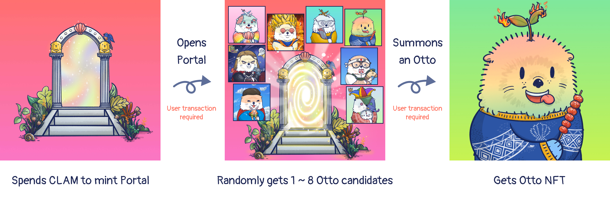
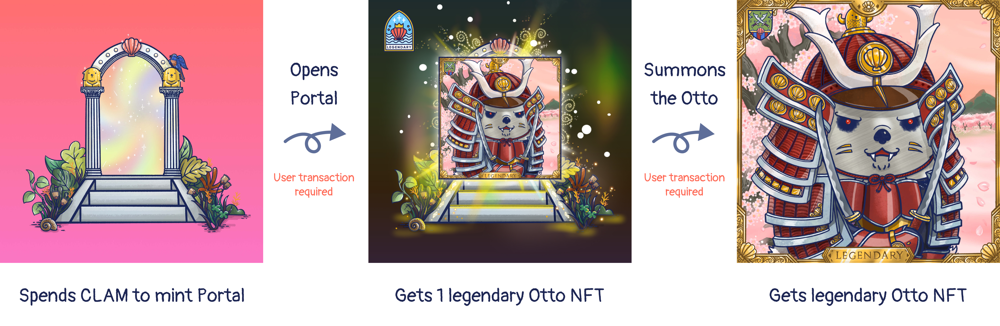

# Portals

To enter the Otterverse and find the floating island, you must generate a portal. Portals can be thought of as intergalactic wormholes that transform humans into otters while sending them to the Otterverse. On the backend, portals represent the minting transaction associated with your Otto NFT. When you mint, you’re effectively buying a portal. In the game, buying the portal represents your entry into the Otterverse, where your mission begins.
After getting a portal, you need to open it. 

## Open Portals

To open the portal requires a single transaction on Otto web. This transaction uses Chainlink VRF to generate an Otto to ensure fairness. Portals only grant one user single entrance into the Otterverse. You can mint your portals on the Otto app. 5,000 portals have been created for the first great migration. If the DAO decides, future migrations are possible. 

There are some circumstances when you open the portal:

### Get 1~8 Otto Candidates

One portal opens randomly from 1 to 8 Ottos, but only 1 can proceed to go through the portal. For this reason, the user will still need to choose 1 Otto to get through the portal and become an Otto NFT. Once it’s confirmed, the portal NFT’s appearance will be changed to the Otto’s!

The attribute values and rarity score on the Otto candidates will not reveal until you summon an Otto. 

**Each Otto candidate may have different strength on attributes. Some might have super high rarity score.** If you are not sure which Otto candidate to choose, you can paste your opened portal link on OtterClam community to ask for suggesitons. This is what makes the summon process fun!

To learn more about the Otto NFT and related subjects, please go to [Otto NFT](./otto-nft).

### Get a Legendary Otto

There is a very small chance that you might open a legendary Otto NFT. If that's the case, there will be only 1 legendary otto at the portal, so you don't have to choose 1 Otto from the other candidates.

The opened portal NFT looks slightly different from the normal opened portal NFT. If you open a legendary Otto, you are the luckest among all other players!

The legendary Otto means its traits are all pre-selected by the Otterclam artist - Appppo, which represents that the legendary Otto NFTs are comparatively beautiful and unique, and possibly rarer than the others! The legemdary Otto has a golden frame decoreated around in the image. For more details about the legendary Ottos, please view [Legendary Otto](./otto-nft#types-of-otto).

## Summon Otto NFT

After deciding your favorite Otto NFT, you have to summon the one you picked to get to the portal and formally join the Otter Kingdom. This process will trigger another transaction to update the NFT appearance.