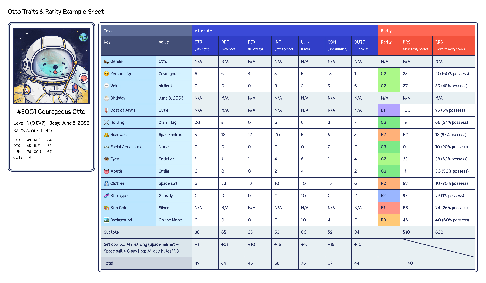

# Rarity Scores

Inspired by Aavegotchi, we are introducing an Otto rarity score. The rarity score is calculated according to the traits each Otto possesses. Each trait has its own **[Base Rarity Score (BRS)](#brs)** and **[Relative Rarity Score (RRS)](#rrs)**.

## Base Rarity Score 

**Base Rarity Score (BRS)** is an absolute value that is assigned to each trait. The more rare traits an Otto has, the higher the base rarity score. 

Trait existance percentage & BRS range sheets:

### Legendary Otto NFT Bonus

Every legendary Otto pocesses a golden frame as a unique trait on the NFT. The golden frame represents that this Otto NFT is artist chosen and all customized, and it will give this Otto NFT extra **BRS 100 points**.

> Please note that if you change, or wear any equipment on the legendary Otto NFT, it means you decided to change the appearance of the Otto. Hence, the golden frame will be consealed, and the extra BRS 100 points will be subtracted until you make the Otto back to the original appearance.

If you don't know what is Legendary Otto NFT, you can check [Legendary Otto](./otto-nft#legendary-otto-nft) to learn more.

## Relative Rarity Score 

**Relative Rarity Score (RRS)** is dynamic (changes based on specific variables) and is calculated based on the distribution of traits among Ottos currently in circulation. As more Ottos are minted via the portal, and more missions are completed, more rare items will eventually come into circulation. As traits come in and out of circulation, the relative score will reflect these changes accordingly. Legendary frame trait does not have RRS.

The formula below defines the Relative Rarity Score of a trait.

`RRS = 100*(1 - traitCount / maxTraitCount)`

*traitCount: The total amount of the item NFT equipped/owned by Ottos.*  
*maxTraitCount: The amount of the most equipped/owned item NFT among the same trait.*

---

The chart below demonstrates how the BRS and RRS are combined to determine a total rarity score for an Otto NFT:

