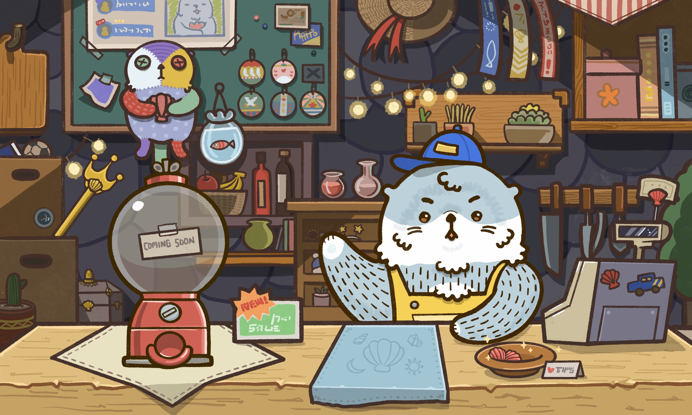
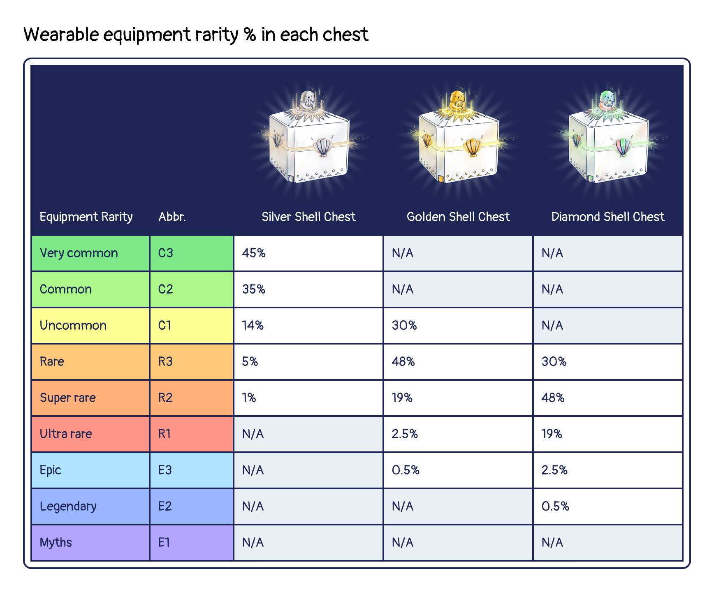
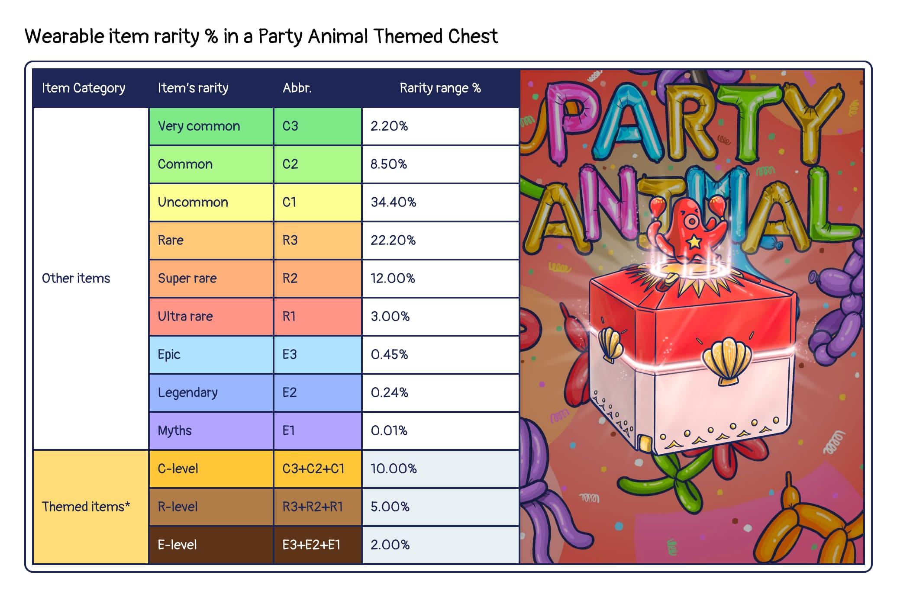
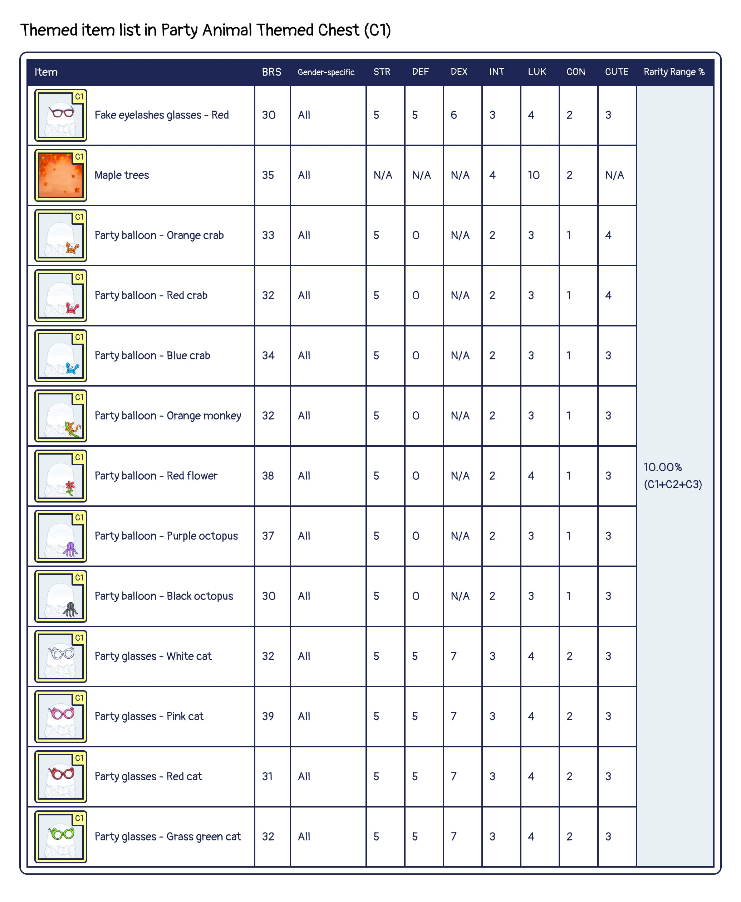
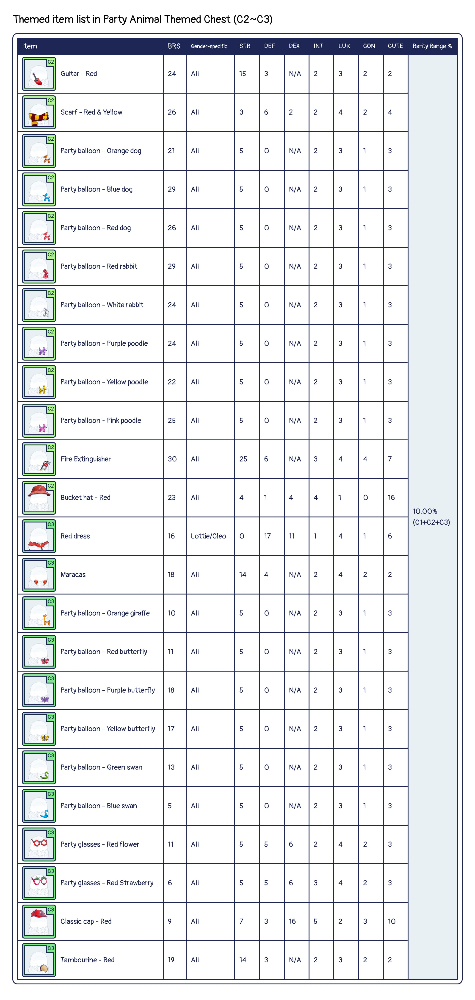
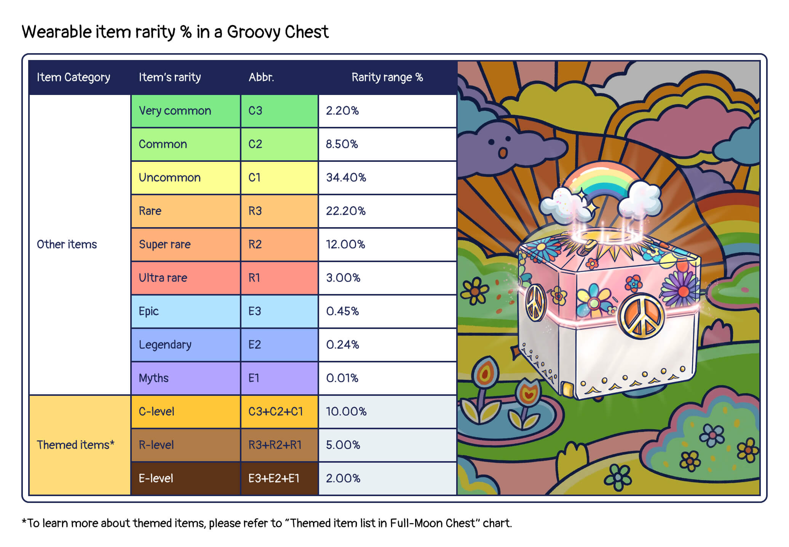
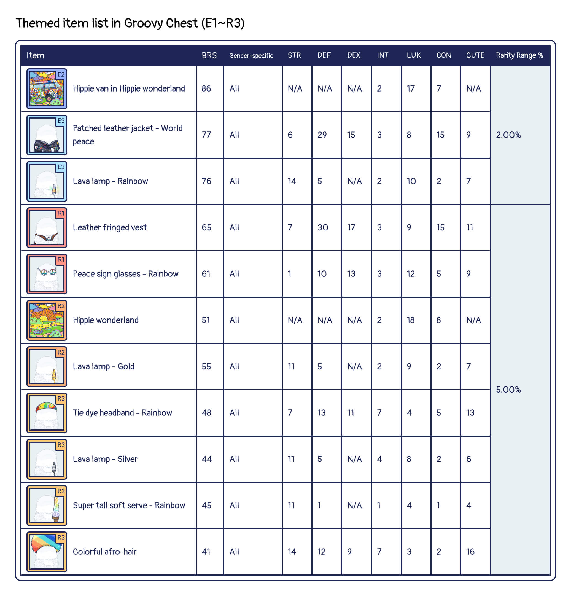
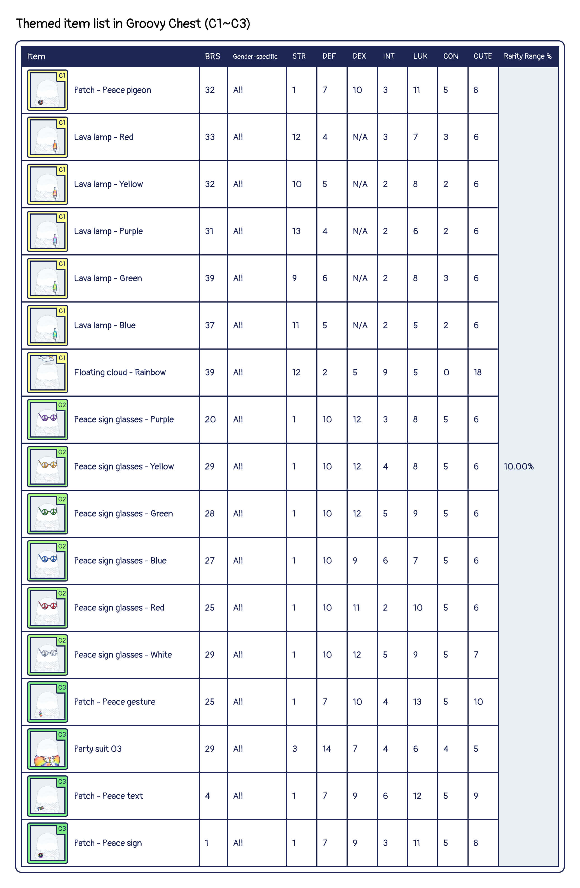

# Store

## Ottopia Store 
The Otter Kingdom has its own Ottopia Store. Here, you can find shell chests to enhance your Otto. You will need CLAM to acquire these items. The revenue generated by the Ottopia Store will also be distributed to the reward pool of the Otter Kingdom, the Otter DAO, and the burn pool (details below). 

## Shell Chest 
Shell Chests can be purchased by visiting the Ottopia Store. There are 3 types of Shell Chests available, each containing wearable item. Your chances of finding higher rarity item or more powerful wearable items increases with higher level Shell Chests!

### Why should I buy Shell Chests?

By puchasing the Shell Chest, you will get the wearable item that you can equip on your Otto NFT to increase the attribute values or boost up its rarity score.

### What does a Shell Chest contain?

Every Shell Chest contains **1 wearable item**. Please visit [Items page](./traits#wearable-item) to learn more about wearable items.

Here is the formula used to show the probability of finding different rarity equipment in each chest.

## Special Chest 
Ottopia occasionally has themed chest sales with gorgeous exclusive items.

### Party Animal Themed Chest

As part of our latest theme of Rarity Ranking Competition, and for a limited time only, we're introducing Party Animal Themed Chests. These chests contain more than 100 brand-new wearable items. More than that, there is approximately a 20% chance of finding a "Red" or "Creature" item that boosts Otto's BRS!

Themed sale duration: September 26th, 0:00:00 ~ October 3rd, 0:00:00 (UTC+0)

Here is the formula used to show the probability of finding different rarity equipment in a Party Animal Chest.

To learn more about the probability of finding themed items in a Party Animal Chest, please refer to the item list below:

### Groovy Chest (Ended)

As part of World Peace Day celebrations, we are offering Ottopia-styled Groovy Chest, which contains hundreds of wearable items, with an additional possibility of finding hippie themed exclusive items. Love and peace to all!

Themed sale duration: September 14th, 0:00:00 ~ September 21th, 0:00:00 (UTC+0)

Here is the formula used to show the probability of finding different rarity equipment in a Groovy chest.

To learn more about the probability of finding themed items in a Groovy chest, please refer to the item list below:

## Ottopia Market (WIP) 

In the short future, the OtterClam DAO is also planning to develop a marketplace for the user to buy and sell various items, even without playing Ottopia. Perhaps you were lucky enough to score a super rare trait on your first mint. You could sell your item at a premium in the market, or you could greatly improve your odds of winning a mission by equipping powerful items. We expect this market to develop a life of its own as the ecosystem begins to flourish.
