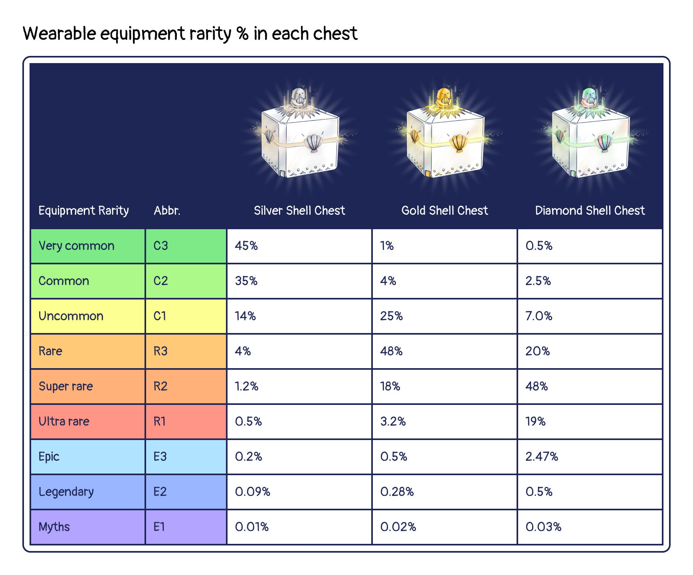
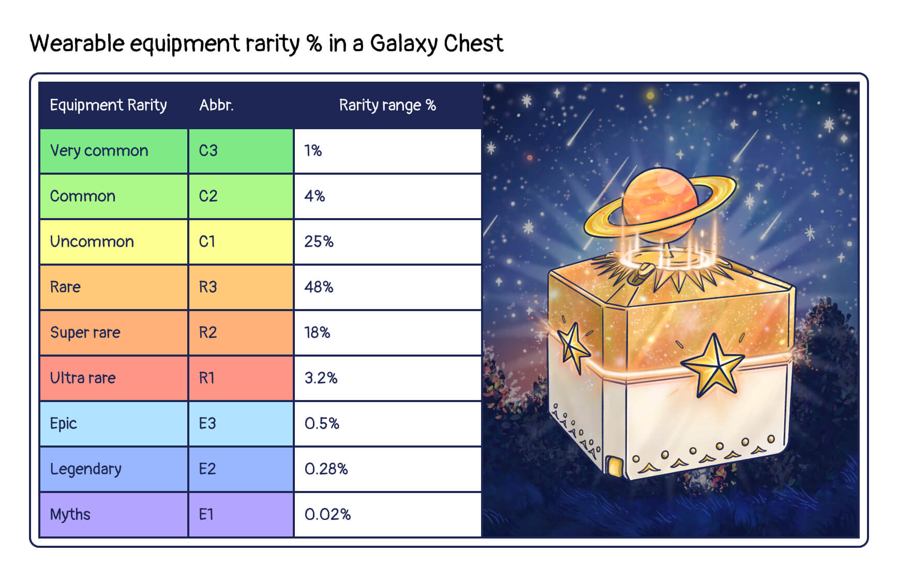

# Store

## Ottopia Store 
The Otter Kingdom has its own Ottopia Store. Here, you can find shell chests to enhance your Otto. You will need CLAM to acquire these items. The revenue generated by the Ottopia Store will also be distributed to the reward pool of the Otter Kingdom, the Otter DAO, and the burn pool (details below). 

## Shell Chest 
Shell Chests can be purchased by visiting the Ottopia Store. There are 3 types of Shell Chests available, each containing wearable equipment. Your chances of finding higher rarity equipment or more powerful wearable items increases with higher level Shell Chests!

### Why should I buy Shell Chests?

By puchasing the Shell Chest, you will get the wearable equipment that you can equip on your Otto NFT to increase the attribute values or boost up its rarity score.

### What does a Shell Chest contain?

Every Shell Chest contains **1 wearable item**. Please visit [Traits page](./traits#wearable-item) to learn more about wearable traits.

Here is the formula used to show the probability of finding different rarity equipment in each chest.

## Special Chest 
Ottopia occasionally has themed chest sales with gorgeous exclusive items.

### Galaxy Chest

As part of our latest Rarity Ranking Competition, and for a limited time only, we're introducing Galaxy Chests. These Chests contain hundreds of wearable items, and each item's DEF value is guaranteed to equal more than 10 points! There are also several exclusive wearable items that can only be found in the Galaxy Chests!

Themed sale duration: August 10th, 0:00:00 ~ August 17th, 0:00:00 (UTC+0)

Here is the formula used to show the probability of finding different rarity equipment in a Galaxy chest.

## Ottopia Market (WIP) 

In the short future, the OtterClam DAO is also planning to develop a marketplace for the user to buy and sell various items, even without playing Ottopia. Perhaps you were lucky enough to score a super rare trait on your first mint. You could sell your trait at a premium in the market, or you could greatly improve your odds of winning a mission by using the trait. We expect this market to develop a life of its own as the ecosystem begins to flourish.
