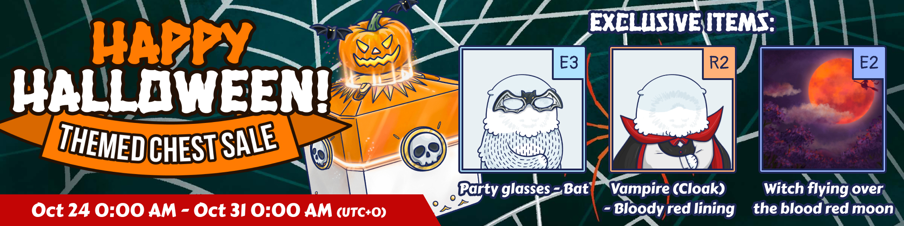
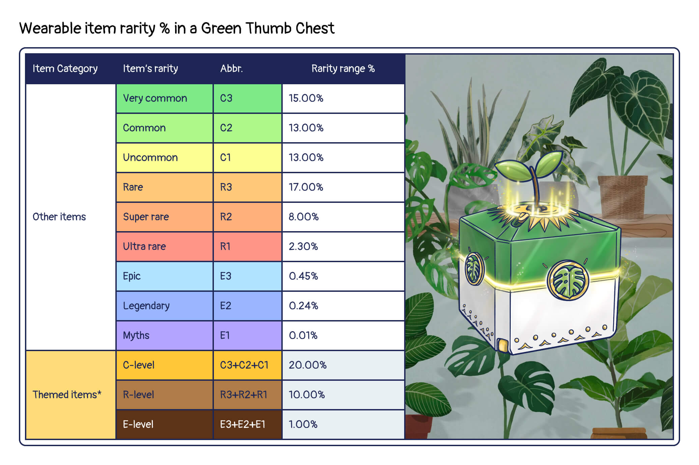
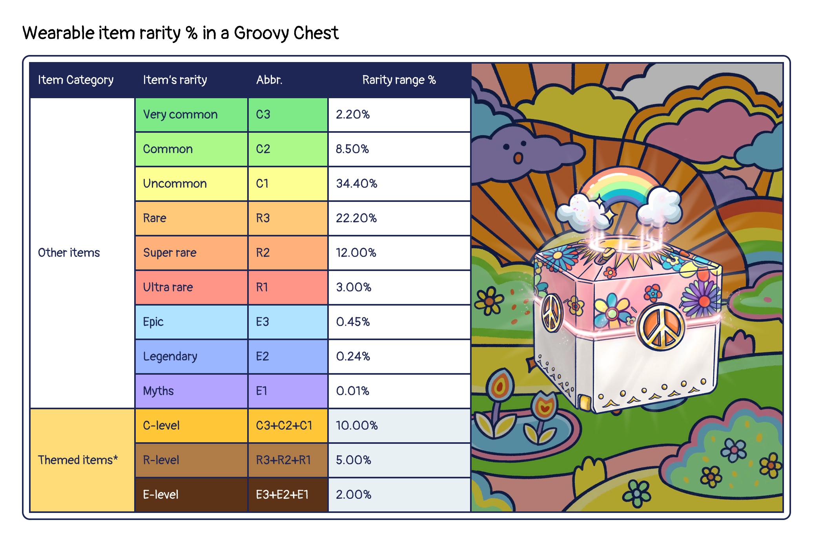

# Store

<header>
<meta property="og:title" content="Ottopia Whitepaper | Store" />
<meta property="og:image" content="https://docs.ottopia.app/assets/images/Store-a0f5ff84aa11b982c5d9d36fdea8f781.jpg" />
<meta property="og:description" content="The Otter Kingdom has its own Ottopia Store. Here, you can find shell chests to enhance your Otto. You will need CLAM to acquire these items." />
</header>

## Ottopia Store 
The Otter Kingdom has its own Ottopia Store. Here, you can find shell chests to enhance your Otto. You will need CLAM to acquire these items. The revenue generated by the Ottopia Store will also be distributed to the reward pool of the Otter Kingdom, the Otter DAO, and the burn pool (details below). 

---

## Shell Chest 

Shell Chests can be purchased by visiting the Ottopia Store. There are 3 types of Shell Chests available, each containing wearable item. Your chances of finding higher rarity item or more powerful wearable items increases with higher level Shell Chests!

### Why should I buy Shell Chests?

By puchasing the Shell Chest, you will get the wearable item that you can equip on your Otto NFT to increase the attribute values or boost up its rarity score.

### What does a Shell Chest contain?

Every Shell Chest contains **1 wearable item**. Please visit [Items page](./traits#wearable-item) to learn more about wearable items.

Here is the formula used to show the probability of finding different rarity equipment in each chest.

---

## Gardening Kit Chest 

Wanna become a gardening master? The Otter Kingdom will periodically release potted planting recipes in the foundry, and the gardening materials needed for the recipes can be obtained directly from this chest. Make your otter life green!

### Why should I buy Gardening Kit Chests?

By puchasing the Shell Chest, you will get the materials to forge a new plant in Foundry. Must of them are very useful for gardening recipes, and the rest are very epic Backgrounds that you can eqip on your Ottos!

### What does a Gardening Kit Chest contain?

Every Shell Chest contains **1 wearable item**.

Here is the formula used to show the probability of finding different rarity equipment in each chest.

---

## Special Chest 
Ottopia occasionally has themed chest sales with gorgeous exclusive items.

### Summer Festival Chest (Ended)

Konnichiwa, festival-goers! We're absolutely delighted to unveil the vibrant world of our freshly launched "Summer Festival Chest"! Submerge yourself in the dazzling spectacle of "Firework", the lively atmosphere of "Matsuri", and the radiant joy of "Summer".

With each "Summer Festival Chest", you're assured a 100% chance of finding a "Firework", "Matsuri", or "Summer" item. And keep your festival fan ready, as there's an exciting 40% chance of discovering entirely new items!

Dive into your festival adventure and let the "Summer Festival Chest" transport you into a world filled with Japanese charm and summer excitement. Let the celebration begin!

Themed sale duration: Jul 3rd 2023, 0:00:00 ~ Jul 17th 2023, 0:00:00 (UTC+0)

Here is the formula used to show the probability of finding different rarity equipment in a Summer Festival Chest.

### Space Ottyssey Chest (Ended)

Greetings cosmic travelers! We're over the moon to invite you to explore the captivating universe of our newly launched Space Ottyssey Chest! Immerse yourself in the hypnotic magic of the "Cosmos", the twinkling "Sparkle" of distant celestial bodies, and the endearing charm of our spacefaring "Otter".

With each Space Ottyssey Chest, you're guaranteed a 100% chance of discovering an "Otter", "Cosmos", or "Sparkle" item. Plus, hold onto your spacesuits, there's a thrilling 40% chance of unearthing completely brand new items!

Embark on your cosmic journey and let the Space Ottyssey Chest propel you to new dimensions of enchantment. To infinity… and beyond!

Themed sale duration: Jun 12th 2023, 0:00:00 ~ Jun 26th 2023, 0:00:00 (UTC+0)

Here is the formula used to show the probability of finding different rarity equipment in a Space Ottyssey Chest.

### Dance Among the Flames Chest (Ended)

We are thrilled to usher you into our bewitching world of the fire festivity! Surrender to the mesmerizing charm of leaping flames and vibrant embers, enveloping you in a dance of warmth and vitality. Amidst a blaze of red fire, we're unveiling the "Dance among the Flames" Chest. This ensures a 100% chance of securing a "Red", "Fire"", or "Magical" item. Plus, a tantalizing 40% chance of discovering entirely new items!

Themed sale duration: May 22nd 2023, 0:00:00 ~ Jun 5th 2023, 0:00:00 (UTC+0)

Here is the formula used to show the probability of finding different rarity equipment in a Dancing Among the Flame Chest.

### Butterfly Garden Party Chest (Ended)

We are delighted to welcome you to our enchanting Purple Butterfly Flower Garden Party! Immerse yourself in the breathtaking beauty of blossoming flowers and delightful fluttering butterflies. Amidst a sea of purple hues, we're launching the Butterfly Garden Party Chest. This guarantees a 100% chance of finding a "Purple", "Flower" or "Butterfly" item, and a 40% chance of finding completely fresh items!

Themed sale duration: May 1st 2023, 0:00:00 ~ May 15th 2023, 0:00:00 (UTC+0)

Here is the formula used to show the probability of finding different rarity equipment in a Butterfly Garden Party Chest.

### Cybercat Chest (Ended)

Introducing the all-new and ever-evolving Cybercat theme! For a limited time, Ottopia will transform into a neon-lit city filled with high-tech, post-apocalyptic vibes and tons of adorable cats. To fully immerse all otters into this punk world, we're launching the Cybercat chest, which contains hundreds of wearable items, including themed items and ingredients from exclusive recipes! More than that, there is approximately a 40% chance of finding an "Cyberpunk", "Cat" or "Black" item that boosts Otto's BRS!

Themed sale duration: April 10th 2023, 0:00:00 ~ April 24th 2023, 0:00:00 (UTC+0)

Here is the formula used to show the probability of finding different rarity equipment in a Cybercat Chest.

### Clambow Carnival Chest (Ended)

Welcome to the final clam reward! Throughout our journey, Ottopia and clams have been inseparable, but it's time to move forward. To celebrate and bid a joyful farewell, we're launching the Clambow Carnival Chest, which contains hundreds of wearable items, including themed items and ingredients from exclusive recipes! More than that, there is approximately a 40% chance of finding an "Carnival", "Rainbow" or "Clam" item that boosts Otto's BRS! 

Themed sale duration: March 20th 2023, 0:00:00 ~ April 3rd 2023, 0:00:00 (UTC+0)

Here is the formula used to show the probability of finding different rarity equipment in a Clambow Carnival Chest.

### Blue Island Holiday Chest (Ended)

Get ready for a blue island holiday! In honor of our hardworking otters, we're launching the Blue Island Holiday Chest, which contains hundreds of wearable items, including themed items and ingredients from exclusive recipes! More than that, there is approximately a 40% chance of finding an "Oceanic", "Blue" or "Resort" item that boosts Otto's BRS!

Themed sale duration: February 27th 2023, 0:00:00 ~ March 13th 2023, 0:00:00 (UTC+0)

Here is the formula used to show the probability of finding different rarity equipment in a Blue Island Holiday Chest.

### Sakura Love Chest (Ended)

Cherry blossom (aka Sakura) season and Valentine's Day are just around the corner! In celebration of the season of love, we're introducing the Sakura Love Chest, which contains hundreds of wearable items, including themed items and ingredients from exclusive recipes! More than that, there is approximately a 40% chance of finding a "Valentine's Day", "Pink" or "Sakura" item that boosts Otto's BRS!

Themed sale duration: February 6th 2023, 0:00:00 ~ February 20th 2023, 0:00:00 (UTC+0)

Here is the formula used to show the probability of finding different rarity equipment in a Sakura Love Chest.

### Rabbit New Year Chest (Ended)

The Year of the Rabbit is just around the corner! In celebration of the Lunar New Year, and for a limited time only, we're introducing our Rabbit New Year Chest, which contains hundreds of wearable items, with a huge possibility of finding the themed items and all ingredients from exclusive recipes! More than that, there is approximately a 40% chance of finding a "Lunar New Year", "Red" or "Rabbit" item that boosts Otto's BRS!

Themed sale duration: January 16th 2023, 0:00:00 ~ January 30th 2023, 0:00:00 (UTC+0)

Here is the formula used to show the probability of finding different rarity equipment in a Rabbit New Year Chest.

### White Ottermas Chest (Ended)

As part of Ottermas celebrations, and for a limited time only, we're introducing our White Ottermas Chest, which contains hundreds of wearable items, with a huge possibility of finding the Ottermas themed items and all ingredients from the Ottermas exclusive recipes! More than that, there is approximately a 40% chance of finding a "Christmas", "White" or "Winter" item that boosts Otto's BRS!

Themed sale duration: December 24th 2022, 0:00:00 ~ January 9th 2023, 0:00:00 (UTC+0)

Here is the formula used to show the probability of finding different rarity equipment in a White Ottermas Chest.

### Pharaoh's Secret Chest (Ended)

As part of our latest theme of Rarity Ranking Competition and Adventure Leaderboard, we're introducing Pharaoh's Secret Chest. These chests contain hundreds of brand new adventurer equipment and ancient Egyptian artifacts. More than that, there is approximately a 31% chance of finding a "Adventure", "Earth Tone" and "Egyptian" item that boosts Otto's BRS!

Themed sale duration: December 5th, 0:00:00 ~ December 19th, 0:00:00 (UTC+0)

Here is the formula used to show the probability of finding different rarity equipment in a Pharaoh's Secret Chest.

### Autumn Themed Chest (Ended)

As part of Clamsgiving celebrations, we are offering our Autumn Themed Chest, which contains hundreds of wearable items, with a huge possibility of finding the Autumn themed items and all ingredients from the Clamsgiving recipes!

In addition to that, the mythical items from one of the beloved deities, Demeter - goddess of the harvest, are available to be found in this chest!

Themed sale duration: November 21st, 0:00:00 ~ November 24th, 0:00:00 (UTC+0)

Here is the formula used to show the probability of finding different rarity equipment in a Autumn Themed Chest.

### Fast Food Chest (Ended)

As part of our latest theme of Rarity Ranking Competition, and for a limited time only, we're introducing Fast Food Themed Chests.  These chests contain a bunch of tasty fast food like pizza, french fries and hamburgers. More than that, there is approximately a 30% chance of finding a "Yellow", "Golden", "Food", and "Fast food" item that boosts Otto's BRS!

Themed sale duration: November 7th, 0:00:00 ~ November 14th, 0:00:00 (UTC+0)

Here is the formula used to show the probability of finding different rarity equipment in a Fast Food Chest.

### Halloween Chest (Ended)

As part of our latest theme of Rarity Ranking Competition, and for Halloween celebrations, we're offering Halloween Chests. These chests contain more than 100 brand-new wearable items. More than that, there is approximately a 31% chance of finding a "Halloween", "Orange", and "Spooky" item that boosts Otto's BRS!

Themed sale duration: October 24th, 0:00:00 ~ October 31st, 0:00:00 (UTC+0)

Here is the formula used to show the probability of finding different rarity equipment in a Halloween Chest.

### Green Thumb Themed Chest (Ended)

As part of our latest theme of Rarity Ranking Competition, and for a limited time only, we're introducing Green Thumb Themed Chests. These chests contain more than 100 brand-new wearable items. More than that, there is approximately a 31% chance of finding a "Green", "Plant", and "Green thumb" item that boosts Otto's BRS!

Themed sale duration: October 10th, 0:00:00 ~ October 17th, 0:00:00 (UTC+0)

Here is the formula used to show the probability of finding different rarity equipment in a Green Thumb Chest.

To learn more about the probability of finding themed items in a Green Thumb Chest, please refer to the item list below:

### Party Animal Themed Chest (Ended)

As part of our latest theme of Rarity Ranking Competition, and for a limited time only, we're introducing Party Animal Themed Chests. These chests contain more than 100 brand-new wearable items. More than that, there is approximately a 20% chance of finding a "Red" or "Creature" item that boosts Otto's BRS!

Themed sale duration: September 26th, 0:00:00 ~ October 3rd, 0:00:00 (UTC+0)

Here is the formula used to show the probability of finding different rarity equipment in a Party Animal Chest.

To learn more about the probability of finding themed items in a Party Animal Chest, please refer to the item list below:

### Groovy Chest (Ended)

As part of World Peace Day celebrations, we are offering Ottopia-styled Groovy Chest, which contains hundreds of wearable items, with an additional possibility of finding hippie themed exclusive items. Love and peace to all!

Themed sale duration: September 14th, 0:00:00 ~ September 21th, 0:00:00 (UTC+0)

Here is the formula used to show the probability of finding different rarity equipment in a Groovy chest.

To learn more about the probability of finding themed items in a Groovy chest, please refer to the item list below:

---

## Ottopia Market (WIP) 

In the short future, the Ottopia DAO is also planning to develop a marketplace for the user to buy and sell various items, even without playing Ottopia. Perhaps you were lucky enough to score a super rare trait on your first mint. You could sell your item at a premium in the market, or you could greatly improve your odds of winning a mission by equipping powerful items. We expect this market to develop a life of its own as the ecosystem begins to flourish.
