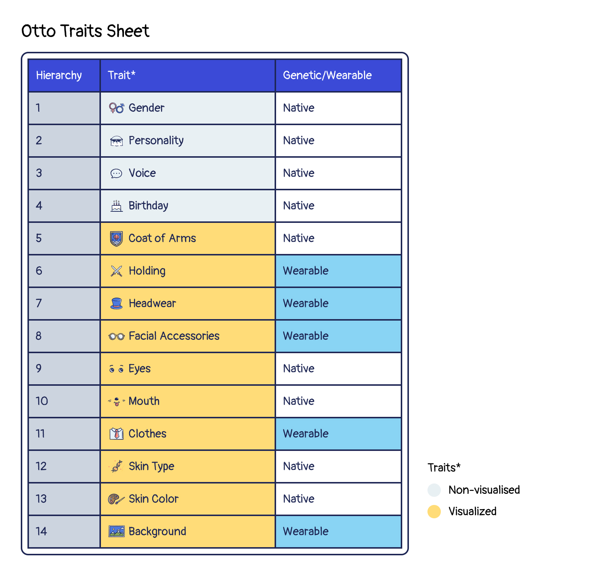

# Traits

## What traits does an Otto NFT possess?

Each Otto, Cleo, or Lottie will have the following traits:

Your otter’s traits, including looks, personality, and voice, will determine its [attributes](./attributes) and [basic rarity scores](./rarity-farming). There are 2 types of traits:

- Native Traits
- Wearable Equipment

### Native Traits 

Native traits are ones your Otto is given at birth. They are extremely difficult to change, but there would be magic potions in the Otterverse that can alter native traits in the future. 

Each Otto NFT has the following Native traits:
- Eyes
- Mouth
- Skin Type
- Skin Color
- Personality
- Voice
- Gender
- Coat of Arms
- Birthday

## Wearable Equipment 

Wearable equipment is technically a trait, and can be attached to our uniquely designed ERC1155 items using ERC998 specs. 

Each Otto NFT has the following Wearable Equipment traits:
- Background
- Headwear
- Object Holding
- Special Accessories
- Clothes

### Equip a wearable item on your Otto NFT 

Despite of the initial traits that comes along with the Otto NFT, you can also equip other wearable items to increase its attribute values and rarity score. If you are going to strengthen your Otto NFT, here are some special cases that you must be aware of before you go further: 

#### Unreturnable items

Please note that the initial wearable traits came along with the Otto the moment it was minted, so it cannot be detached and returned to your item inventory. You can still wear another wearable item to replace and hide it. If the other wearable item is taken off, this item will be visible again on the Otto NFT.

#### A Note on Equipment:

Although your Otto will be minted with a specific set of equipment (some will have very basic equipment, others will have special, rare equipment), you can acquire additional equipment by purchasing shell chests in the [Ottopia Store](./store). You also have the chance to win rare equipment if your team completes a mission.
