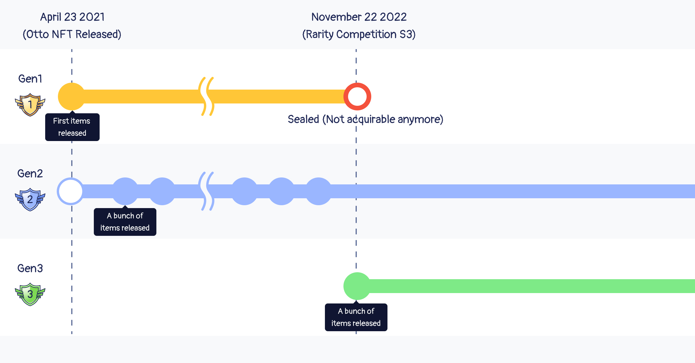

# Traits & Wearable Items

<header>
<meta property="og:title" content="Ottopia Whitepaper | Traits & Wearable Items" />
<meta property="og:image" content="https://docs.ottopia.app/assets/images/hero-5be89801c9873fd27a1c718340251ed2.jpeg" />
<meta property="og:description" content="Your otter’s traits, including looks, personality, and voice, will determine its attributes and basic rarity scores." />
</header>

## What are traits and wearable items?

Your otter’s traits, including looks, personality, and voice, will determine its [attributes](./attributes) and [basic rarity scores](./rarity-farming). There are 2 types of traits:

- Native Traits
- Wearable Equipment

Each Otto, Cleo, or Lottie will have the following traits:

## Native Traits 

Native traits are ones your Otto is given at birth. They are extremely difficult to change, but there are rumors of magic potions in the Otterverse that can alter native traits.

## Wearable Item 

Wearable Items can be worn or taken off of an Otto. (There is an exception if the wearable item is born with the Otto. Please check [nonreturnable items](#nonreturnable) for more details.​) The wearable items can be attached to our uniquely designed ERC1155 items using ERC998 specs.

Each Otto NFT can customize the following wearable item types:
- Holding
- Headwear
- Facial Accessories
- Clothes
- Background

### Equip a wearable item on your Otto NFT​ 

In addition to the initial traits/items that come along with the Otto NFT, you can also equip other wearable items to increase its attribute values and rarity score. If you are going to strengthen your Otto NFT, here are some special cases that you must be aware of before you go further:

#### Nonreturnable items 

Please note that the initial wearable traits come along with the Otto the moment it is minted, so it cannot be detached and returned to your item inventory. You can still wear another wearable item to replace and hide it. If the other wearable item is taken off, this item will be visible and the Otto will receive the stat/rarity bonuses of that nonreturnable item again.

#### A Note on Equipment:

Although your Otto will be minted with a specific set of equipment (some will have very basic equipment, others will have special, rare equipment), you can acquire additional equipment by purchasing shell chests in the [Ottopia Store](./store). You also have the chance to win rare equipment if your team completes a mission.

## Item Collections  

Unlike native traits, wearable items can be categorized by collection. In the Otter Kingdom, two collections of wearable items have been released so far: **Gen1** and **Gen2**.

One of the most notable features of Item Collections is that after a period of time, the collection will be enshrined. Once the enshrining takes place, these items will not be able to be found or freshly minted from Shell Chests any longer. (The items coming along with the Otto minted from Portal are not be affected, though) The Otter DAO will determine the release and enhrining time for each item collection.

### Gen1

Gen1 was released on 23rd April 2021 along with the first generation Otto Portals. There are currently 596 items in Gen1 with the following breakdown:

- Background: 76
- Headwear: 222
- Object Holding: 110
- Special Accessories: 62
- Clothes: 126

If you've been following OtterClam for a while now you know that we're constantly releasing new items for our Otto NFTs. Now that we've reached a large number of items available it's time to bid adieu to the 1st Generation items.

After **28th November, 2022 8:00 AM UTC**, all Gen1 items will be enshrined.

### Gen2

All added items during 23rd April 2021 8:00 AM UTC ~ 28th November, 2022 8:00 AM UTC belong to Gen2.

### Gen3

The moment the Gen1 items get enshrined from **28th November, 2022 8:00 AM UTC**, all new items added afterwards will be part of Gen3. 
Once the number of items in this collection reaches about 600, we will stop adding items to Gen3 and start Gen4.

Make sure to join our weekly games/events for Shell Chest prizes, but you can always crack open some chests from the Ottopia store too!

Enshrined collections may be given rarity and/or attribute boosts after a certain period of time.

