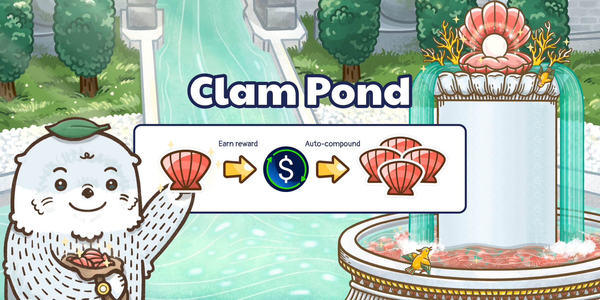
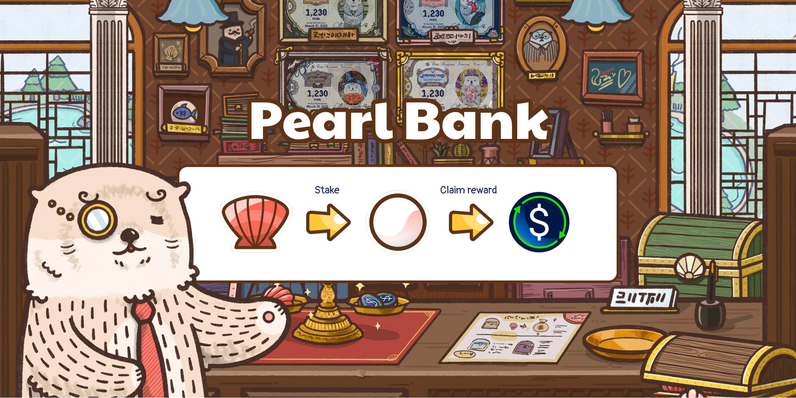

# Staking

Ottopia has a DAO-directed treasury working behind the scenes that invests in lower-risk DeFi protocols to earn rewards.
We provide two reward staking pools. Both pools boast similar APY/APRs, yet distribute rewards in different ways.

## Clam Pond

- Stakers in Clam Pond receive auto-compounding CLAM. The rewarded CLAM comes from the open market, purchased with treasury revenue. Rewards are received at the end of each reward timer (every 24 hours).
- Because Clam Pond rewards are received in “bought back” CLAM, Clam Pond is continuously reducing the circulating supply of CLAM on the open market. Not only will this enable Clam Pond stakers to stockpile more CLAM, it should also prove beneficial to the overall valuation of CLAM.
- There’s a 1% early withdrawal fee within 30 days of staking. The timer will reset if you add more CLAM into the pool.

Visit Clam Pond here: https://ottopia.app/treasury/pond

## Pearl Bank

Aside from the reward mechanics and auto compounding in Clam Pond, there are few differences between Clam Pond and Pearl Bank.

- Like Clam Pond, token locking is not required in Pearl Bank. Pearl Bank is not an auto-compounding pool, the rewards from this pool are claimable as USD+ (USD+ is an interest-bearing stablecoin fully collateralized by $USDC, $DAI, as well as $USDT).

_Find out more about USD+ by visiting their [website](https://overnight.fi/)._

- Pearl Bank offers a very similar APY to that of Clam Pond if you were to reinvest all of your USD+ rewards into Pearl Bank over the course of a year.
- Both pools have an early withdrawal fee of 1% within 30 days of staking. This timer will reset if you add more CLAM into the pool.

Visit Pearl Bank here: https://ottopia.app/treasury/bank
