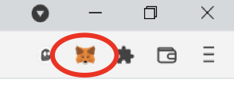
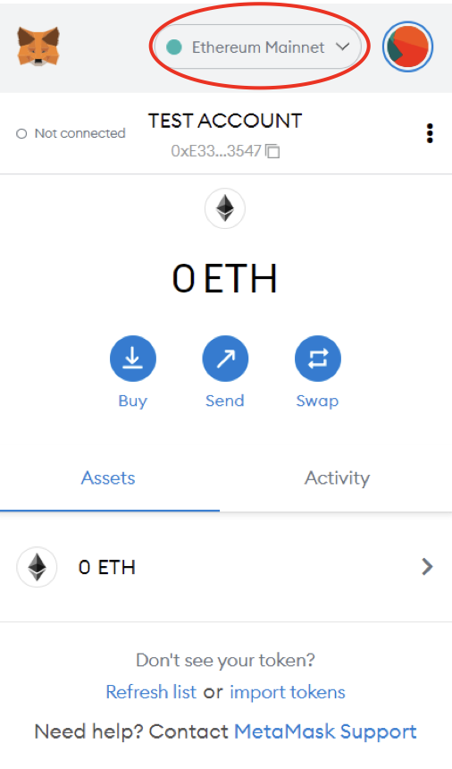
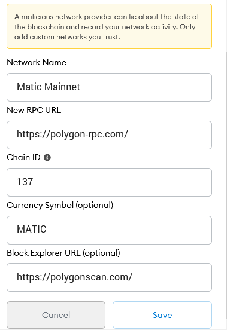
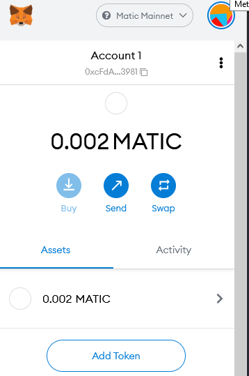
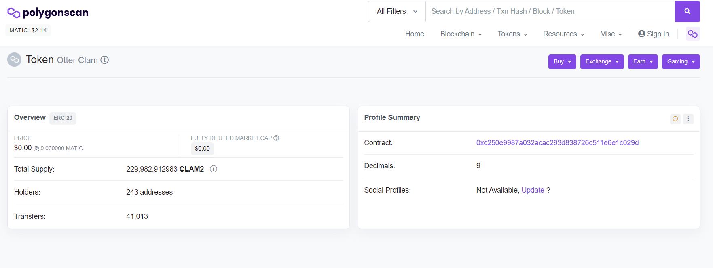
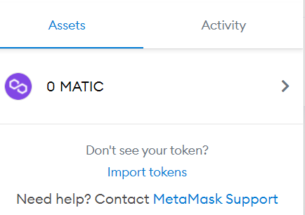
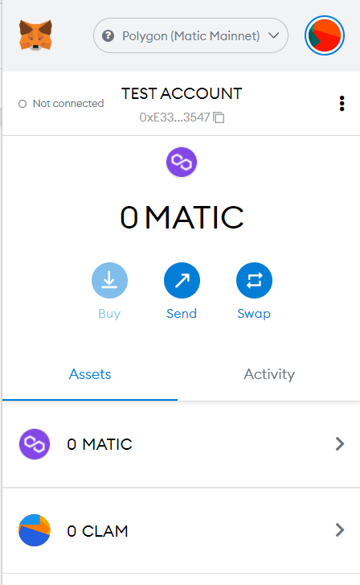
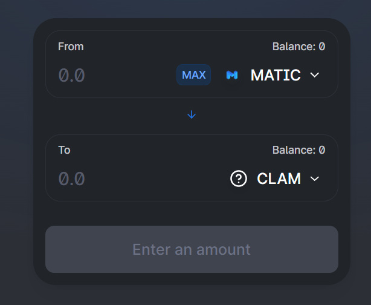

# Polygon and Metamask

### **How to get started on Polygon** 

In this guide, we'll explain everything you need to know to start using the different DApps (decentralized applications) that Polygon has on its blockchain.

### **What is Polygon?** 

Polygon is a network built on top of the Ethereum Blockchain (layer 2), designed to address the scalability issues of the Ethereum Mainnet. On average, a transaction on the Polygon network takes between 3 and 5 seconds, and costs fractions of a penny, allowing a user to make several dozens of transactions every day, with a very small amount of tokens in their wallet.

Polygon is also one of the first “side chains” that launched, and through its first mover advantage has managed to collect:

- An ever-increasing user base
- An ever-increasing number of applications
- A solid TVL that is currently stabilizing around 4 billion USD

Polygon also managed to build trust and proved to be a reliable alternative to the Ethereum network, opening the DeFi world to small investors willing to try decentralized finance without having to spend hundreds of dollars in transaction fees.\

With this trust and ease of use, many companies have turned to Polygon to facilitate bridging assets from one network to another, increasing security and anonymity, eventually making the network stronger.

More info: [https://polygon.technology/](https://polygon.technology)\

### **Creating a wallet** 

Before using the Polygon network, you will need to create a wallet address. There are different wallet types, **software (Metamask, TrustWallet...)**, and **hardware (Trezor or Ledger)**. In this guide, we'll use _Metamask_ to explain how to access the Polygon network.

Metamask is a crypto wallet implemented as a browser extension. Created with the Ethereum blockchain in mind, it is flexible and customizable to access several blockchains.

It can be installed on PC, and mobile (IOs and Android)

### **Downloading Metamask** 

The first step you need to do to use the Polygon network is to install the Metamask extension on your browser by downloading it from the Metamask [Website](https://metamask.io/index.html).

Once downloaded and installed, you should see it in your browser extensions area.

When you open it for the first time, Metamask will ask if you have a Metamask account. if yes, you need to write the \*\*seed phrase (\*\*we'll get to the importance of the seed phrase later) \_\*\*\_of the account you want to import.

If you don't have an account, you'll have to create a new one.

These are the steps that you need to follow:

1. First of all, you'll need to select a password for your Metamask account.
2. Then you should watch the video about how to protect your wallet and the importance of the seed phrase.
3. You'll see your seed phrase. Your seed phrase is the **most important** thing when creating a new wallet because it allows you to access and restore your account (and so access your tokens) even on a different device!
4. If you lose your seed phrase and your computer breaks, you won't be able to access your Metamask account again!!
5. So please, be careful with your seed phrase, save it in a safe place (\*) and don't share it with anyone. (\*) maybe a paper sheet too

When you are done, you should see something like this on your browser:

### **Adding the Polygon network to Metamask** 

As you can see in the picture above, Metamask by default creates a wallet in the Ethereum Mainnet (see the red ellipsis in the above figure).

Clicking on the network name opens a dropdown menu allowing you to switch to a different network. You'll see that the Polygon Mainnet isn't there. Don't worry, we just need to manually add the Polygon Mainnet.\

To do so, you need to

1. Open the networks dropdown
2. Click on **Add network**
3. Click on **Custom RPC** and write this:

(\*) depending on the Metamask version the screen may be a little different

Once you're done, you are almost ready to use the Metamask wallet on the Polygon network. Now switch from Ethereum Mainnet to Polygon Mainnet.

To do so you need to click on the dropdown menu at the top of the Metamask extension.\

### **Getting free MATIC** 

Now you have everything set up to use the Polygon Blockchain, however, you don't have any MATIC on your wallet, so you can't do any **transactions** on the Polygon network

A transaction is an exchange between 2 addresses, that require some time to be processed (this is done by the different validators that Polygon has) and has a fee (this fee is also known as **gas** and is paid with MATIC tokens).

Luckily, there are the so-called _faucets_ that can help us to have a minimal amount of tokens for our first transactions. The [Matic Supply](https://matic.supply) faucet gives you free MATIC. The only thing you need to do is connect your wallet to that page and complete a captcha. You will receive 0.002 MATIC (\~0,00223$) which will allow us to do a few transactions using the Polygon Network.

Sometimes due to network congestion, you may have some problems using that page, so you’ll need to wait for a little while and try again.

Or you can try using two other ones in case the first doesn't work:

- [Mac ‘n Cheese](https://macncheese.finance/matic-polygon-mainnet-faucet.php)
- [Umbria Matic Faucet](https://faucet.umbria.network)

Be aware that these faucets are not done for people to drain it, they won't deliver anything if your wallet has too much MATIC, or if you try to claim more than a few times within a 24 hour period, so please, be careful and don't be selfish.

### **Importing Tokens in Metamask** 

Now that you have some free MATIC in your Metamask, you are ready to use the different DApps and tokens in Polygon.

At first, you need to add to Metamask the token you’re interested in. In our case, CLAM.

Here are the steps needed

1. You will need to know the token contract address: CLAM Contract Address is 0xC250e9987A032ACAC293d838726C511E6E1C029d or you can find it in [PolygonScan](https://polygonscan.com) too, searching for Otter Clam

1. Click on “Import token” in Metamask

1. Paste the CLAM address in the Token Contract Address field

1. Click on “Add custom token” and then import tokens
2. Now you’ll see the CLAM token on Metamask

**Bridging to Polygon**

A blockchain bridge is a connection that allows the transfer of tokens and/or arbitrary data from one chain to another chain or layer. Both chains can have different protocols, rules, and governance models, but the bridge provides a compatible way to interoperate securely on both sides.

So, using a bridge you can send your tokens from other chains to Polygon.

Here is a non-exhaustive list of some popular bridges you can use.

**The Polygon Bridge**: [https://wallet.polygon.technology/bridge](https://wallet.polygon.technology/bridge) allows the transfer of tokens (ETH and others) from the Ethereum Chain to Polygon.

**Umbria Bridge**: [https://bridge.umbria.network/bridge/ethereum-polygon/eth](https://bridge.umbria.network/bridge/ethereum-polygon/eth) allows the transfer of tokens from the Ethereum Chain and BSC to Polygon (ETH, USDC, USDT, WBTC, others) with low fees.

**Multichain (formerly Anyswap)**: [https://app.multichain.exchange/#/router](https://anyswap.exchange/#/router). It allows the transfer of tokens from several chains to Polygon (WETH and several stablecoins). There are flat transfer fees (but they may vary per coin). There’s a minimum amount to send.

**EvoDefi**: [https://bridge.evodefi.com/](https://bridge.evodefi.com). It allows the transfer of tokens from several chains to Polygon (ETH, USDC, USDT, and others). It has the nice feature of providing a minimum amount of MATIC in your wallet to perform a transaction. It applies a 0.5% commission. Minimum amount to transfer: 50$

**CBridge**: [https://cbridge.celer.network/#/transfer](https://cbridge.celer.network/#/transfer) . It allows the transfer of tokens from several chains to Polygon (ETH, USDC, USDT, and others) with a small commission.

Before transferring your token via a Bridge always check the commissions applied (gas + bridging commission). Remember that a transfer via a Bridge can take more time than a normal, on-chain, transfer.

### **How to buy tokens on Polygon** 

Now that we have our Metamask ready and some MATIC to pay for the gas fees, we can start buying some tokens on the Polygon network. To do so, you need to use a **DEX** (Decentralized Exchange), there are a lot of DEXs that you can choose from, like[ Quickswap](https://quickswap.exchange/#/swap), [Slingshot](https://app.slingshot.finance/trade/m/MATIC/USDC),[ Dexguru](https://dex.guru),[ Sushiswap](https://app.sushi.com/swap), [Zapper](https://zapper.fi/es/exchange), and many others.

Once you decide which DEX you want to use, you can start buying your favorite tokens on the Polygon Blockchain.

**Zapper** is a little different from other DEX. It works as a decentralized exchange aggregator, to find the best trade across different exchanges in terms of price and slippage. Hence it removes the need to ever manually search for the best price.

It may be a good way to save up some MATIC.\

### **Checking your wallet history** 

It's important to know how to check your wallet's history. To do so, you can use[ DeBank](https://debank.com). Debank will allow you to check the different transactions that you have made in your Metamask account, as well as check your portfolio in all the blockchains that you use or the NFTs that you own.\

### **Useful Links** 

Here are some links that you may find useful when using the Polygon Blockchain:

[Quick Swap​](https://quickswap.exchange) : a DEX where you can buy CLAM

[MaiFinance](https://app.mai.finance): a DAO providing borrowing of stablecoins (MAI) **with zero fees**

[AAVE](https://app.aave.com)​: a popular lending and borrowing protocol

[PolygonScan](https://polygonscan.com/gastracker/): the Polygon Chain Explorer. It May be useful for seeing your wallet info, contracts info, and the gas prices on the Polygon Network
